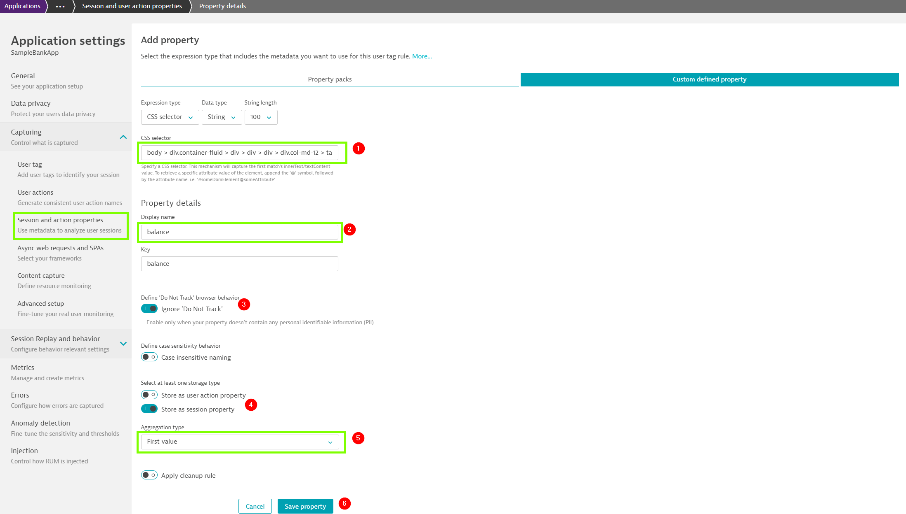
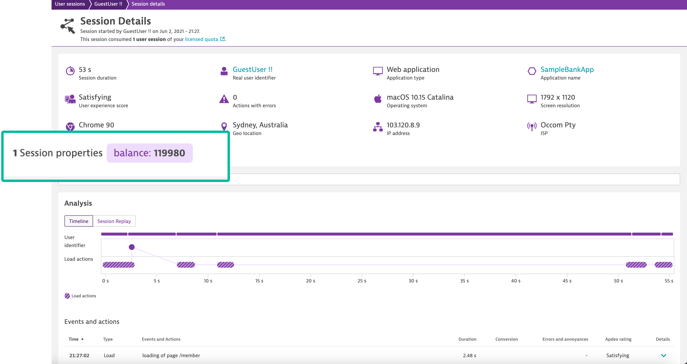

## User Session-Property

In this exercise, we will need to define the Request attribute to track specific request.

### Why session property

Session properties can be leveraged for deep visibility into all the details of your users’ interactions with your application and it can provide additional information wrt to your end-users behavior on the application.

### How to define a user-session property

Similar to user-tagging, dynatrace offers multiple avenues to define a session-property and can integrate with different property packs like Adobe, Google, etc. However, in this exercise we will limit ourselves to use *CSS selector* to define session property.

### Steps to define the user-session property

Let us leverage session-property that will help us identify one of the attributes of user's bank-account at end of the session. Let us consider **balance** as the attribute and identify its CSS selector as below:

1. Within your application, click on **Fund Transfer** and enter an arbitary mount say **120000**.
1. Further click on **Go Back** to navigate to home page.
1. Now, follow the steps below to identify the CSS selector.

Now with the CSS selector identified as `body > div.container-fluid > div > div > div > div.col-md-12 > table > tbody > tr > td:nth-child(4)`, proceed to Dynatrace tenant and follow the steps below

1. Select "Application" from the navigation menu and select "SampleBankApp"
1. Click on "..." and select "Edit"
1. Click on "Capturing" and select "Session and action properties"
1. Select "Add property" and **Custom defined property** tab
1. Select **CSS selector** from "Expression type", paste the CSS selector details copied earlier
1. Provide "Display name" as **balance** and the key will be auto detected as **balance**
1. Enable "Ignore 'Do Not Track" and "Store as session property"
1. Followed by changing the "Aggregation type" to **First Value** and click on "Save property"

After setting it up, perform user actions to generate user session/session property. Session property is populated only for completed session, so terminate the session by performing the steps as below:

To review it, navigate to "User Sessions" and select the generated session. Under the session we can see our defined user session property as highlighted,

As the session was completed with **119980** final balance in the above example, session-property was determined to be **119980**.

<!-- ------------------------ -->
