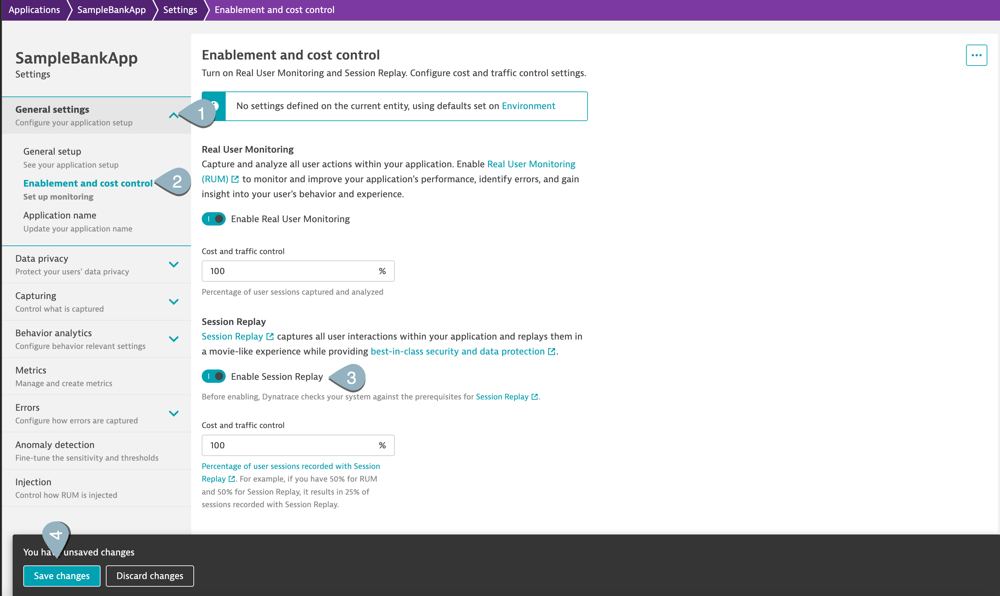
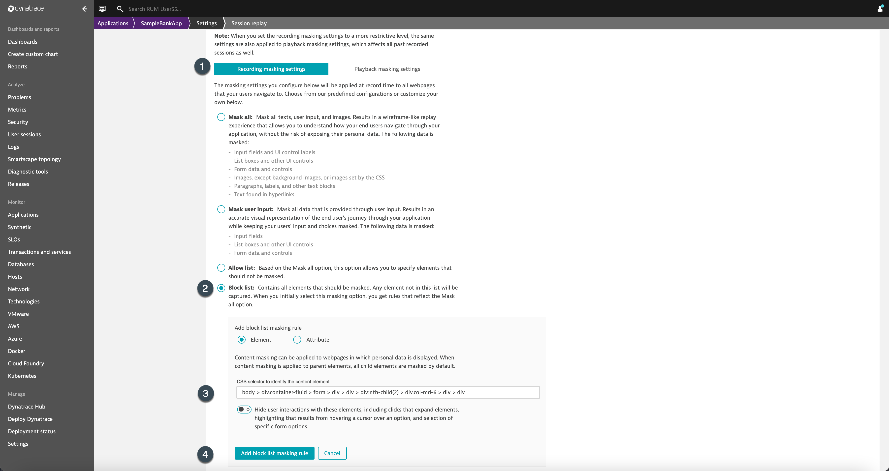

## Session Replay

In this excerise, we will configure Session replay and check the session replay which captured the user session.

### Enable session replay

1. To enable Session Replay navigate to the **Web** menu
1. Select the application which needs to be configured.
1. Select the **More [...]** button **> Edit**.
1. From the application settings menu, go to **General settings > Enablement and cost control** and turn on **Enable Session Replay**.

### Masking Session Replay

Session Replay implements masking functionality that ensures that private user information is either not captured at the time of recording and/or masked at the time of session playback.

Navigate to **Data Privacy > Session Replay** to make changes in the configuration to suite your session-recording requirements. Doing so would not require any changes in the application code while adhering to your policies. The functionality is used to hide interactions with specific elements that might inadvertently reveal confidential end-user information. By default, dynatrace provides some rules that would mask all *user input* and make session-replay tool available to **study UI functionality**.

### Sample Session Replay with default settings

We can notice that the session-replay recorded all the UI components and masked any input that the user has provided.

### Benefits of Session Replay

Whilst using the above default settings helped to identify any issues with the UI, dynatrace also automatically detects the sensitive information like credit-card information, password and does not record it. Additionally, you can set rules to mask any information that you deem as sensitive information. Doing so, would help you to identify/rectify any issues with your application that would have been triggered by certain user-actions and capture the entire user-journey.

Now, let us add a rule to mask the amount that the customer is entering while making the transaction. To do so, navigate to **Web > SampleBankApp > [...] > Data Capture > Session replay** and follow the steps as below:
1. Remove all the existing masking rules by clicking on "X"
1. Further, click on *Add block list masking rule* under *Recording masking rules* and add the rule to mask the *Amount's CSS selector*

### Session Replay with block config

Now, run some user-actions on the application and navigate back to the tenant to identify that Dynatrace masked **Amount** input by user as configured in our rule earlier.

