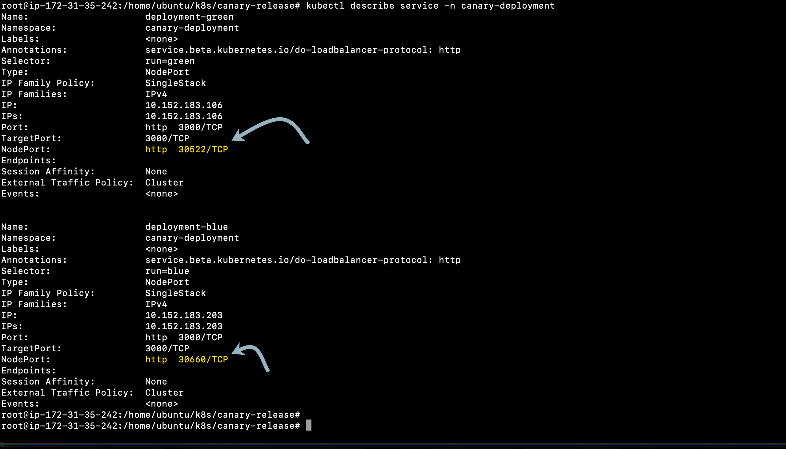

## Canary release
In this step, we will deploy two different versions of the application.

Within your terminal, navigate to `/home/ubuntu/k8s/canary-release` folder and run the following commands:
```
$ cd /home/ubuntu/k8s/canary-release

$ microk8s enable ingress

$ kubectl create ns canary-deployment

$ kubectl apply -f green-deployment.yaml -n canary-deployment

$ kubectl apply -f blue-deployment.yaml -n canary-deployment

$ kubectl apply -f mongo-deployment.yaml -n canary-deployment

$ kubectl apply -f mongo-service.yaml -n canary-deployment

$ kubectl apply -f ingress-service.yaml -n canary-deployment

```

This would create two deployments of the application `blue` and `green`. Identify the nodePort of the releases by running the following command:
```
$ kubectl describe service -n canary-deployment
```


Note the nodePort as you will need it to connect to your application. In the next step, we will apply configuration that helps to pick the release details and associate with the user-session.

