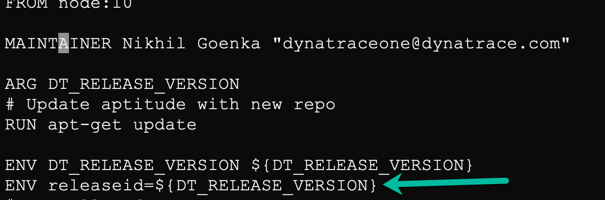
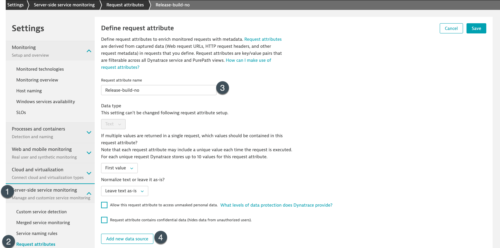
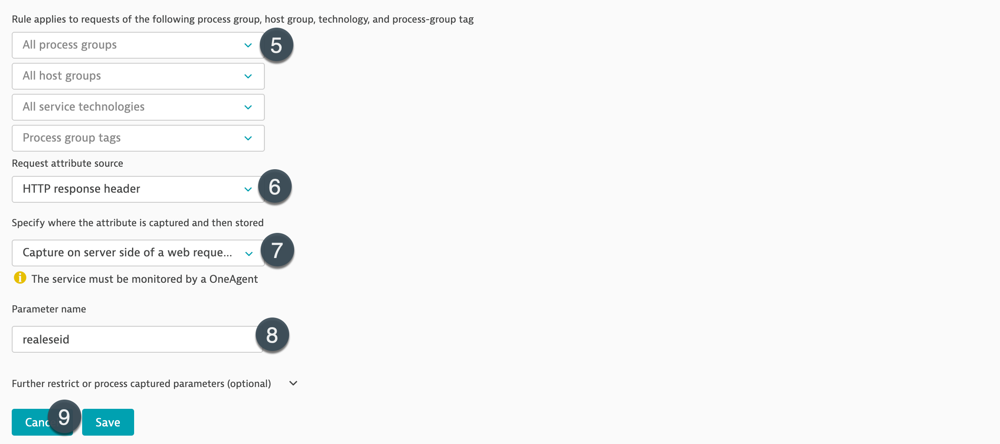
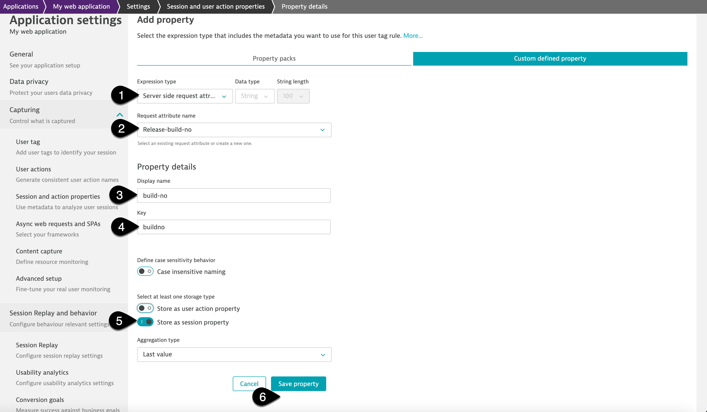

## Request Attribute
In this step, we will setup session property so that we can identify build details for the user using the application.

For helping dynatrace identify details of the build-number, we would leverage session-properties. So, the first step would involve to push build details in the code.
That is already implemented in our samplebank as seen in the image below:

So, we will proceed with setting up the session-properties.

1. To do so, within dynatrace tenant navigate to **Settings>Server-side service Monitoring>Request attributes** and setup the request attribute as below:
**Request attribute name**: Release-build-no
**Request attribute source**: HTTP response header
**Specify where the attribute is captured and then stored**:  Capture on server-side of a web request
**Parameter name**:  releaseid

2. Once the request attributes are set, let us leverage session properties to retrieve the build version on each useraction/property. To do so, follow the steps as below:

* Select "Frontend" from the navigation menu and select "My web application" (we have not set rules for the new nodePorts, hence we will use the default application)
* Click on "..." and select "Edit"
* Click on "Capturing" and select "Session and action properties"
* Select "Add property"
* Select **Server-side request attribute** from "Expression type" and select **Release-build-no** from the dropdown for Request-attribute name.
* Lastly, provide "Display name" as **build-no**, key as **buildno** and enable "Store as Session property" and click on "Save property"

The above will help Dynatrace identify where the user-sessions have originated from and thus, tagging them. This further can help you to identify if there are any potential issues with a specific build.

<!-- ------------------------ -->
