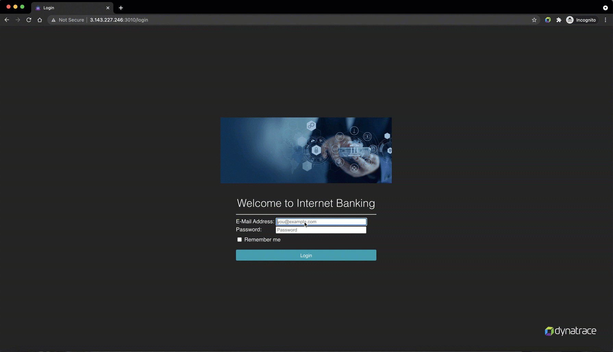
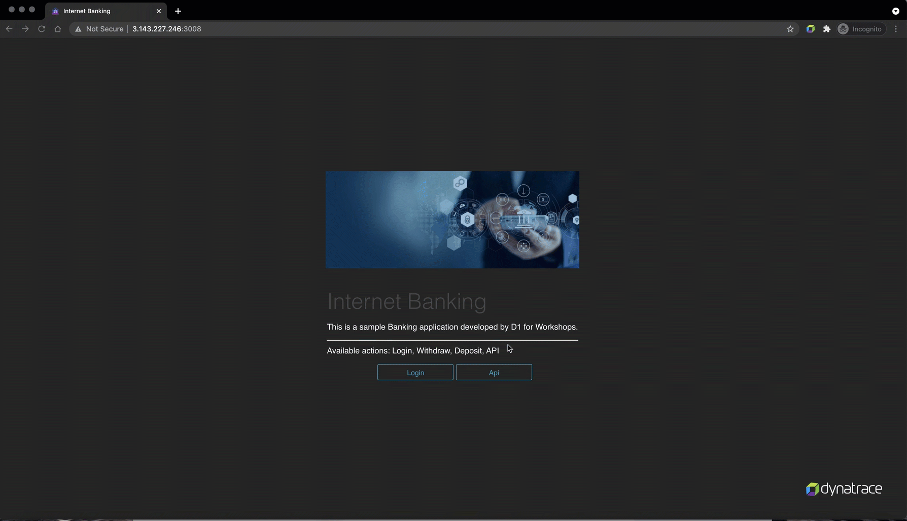
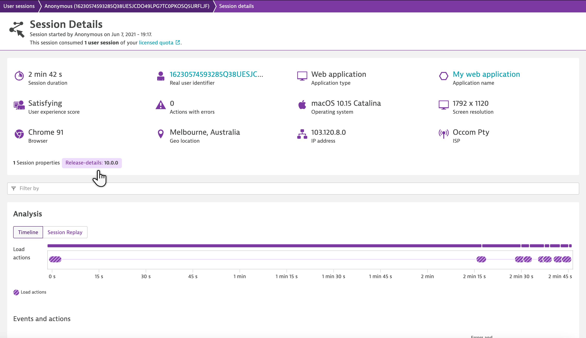
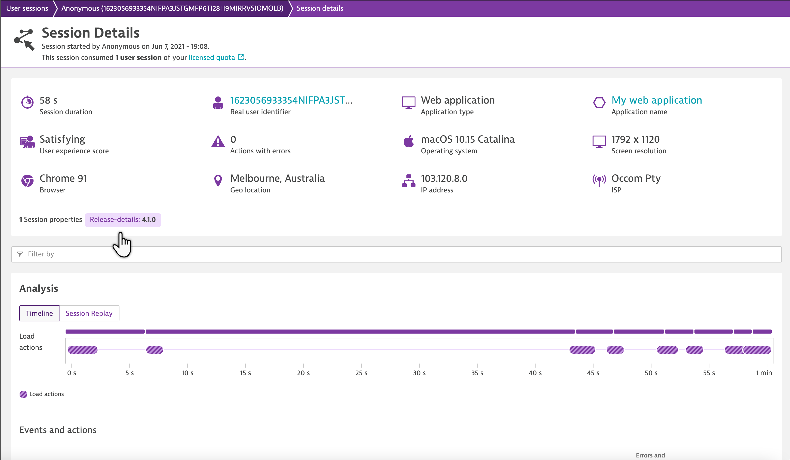

## Perform user-actions and identify the session build details

In this step, we will invoke some user-sessions from each application and see how Dynatrace can help identify the buildno

1. To do so, connect to application in an incognito window at `http://Instance-IP:{NodePort}/register` and register with following details:
**Name**: Guest User
**E-Mail Address**: guestuser@mybank.com
**Password**: GuestUser12@
**Card No**: 123456789

1. Once registered, login into the application at `http://Instance-IP:{NodePort}/` in an incognito window with following credentials
**Username**: guestuser@mybank.com
**Password**: GuestUser12@

1. Now perform some user-actions like deposit, withdraw on the application

1. As mongodb is shared between the two applications, we can use the same credentials to connect to the application at `http://Instance-IP:{NodePort}/login` and perform similar user-sessions.

Once the session are terminated, Dynatrace would tag the buildno for each of those sessions as session-properties, thereby, helping to identify the build from which the user-session was routed internally.

<!-- ------------------------ -->
