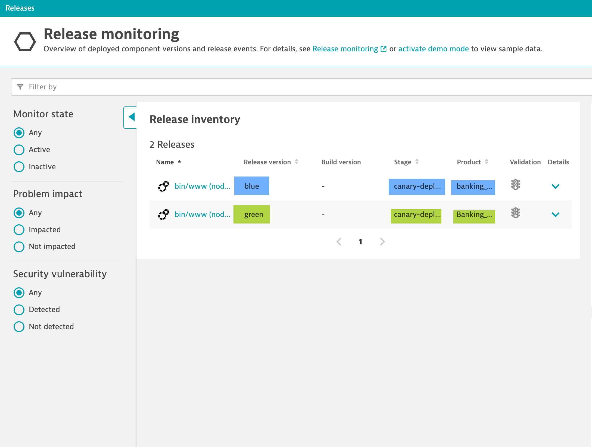
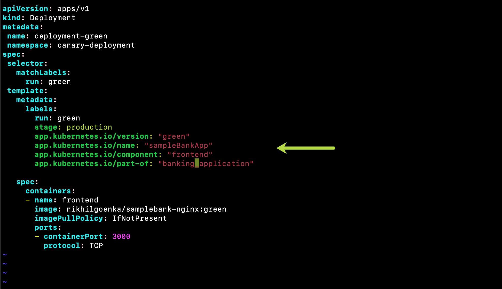
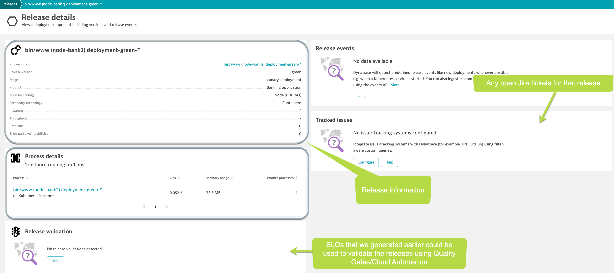

## Release information
In this step, we will see how you can identify the different releases in your environment using some of the **Cloud Automation** terminology.

Dynatrace uses built-in version detection strategies to support different technology standards for versioning that can be influenced by environment variables, Kubernetes labels, and events ingestion.

In our case, as we have kubernetes integration setup, Dynatrace would use the labels to automatically identify the releases, stage of the release process, associated applications/processes with the workernodes, etc. To view the release information, navigate to **Releases** page.

The release information is picked up using our manifest labels automatically.

Navigating into a specific release will give you detailed information about that release as below:

<!-- ------------------------ -->
