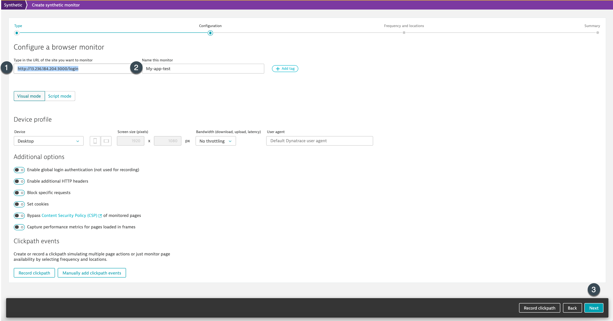
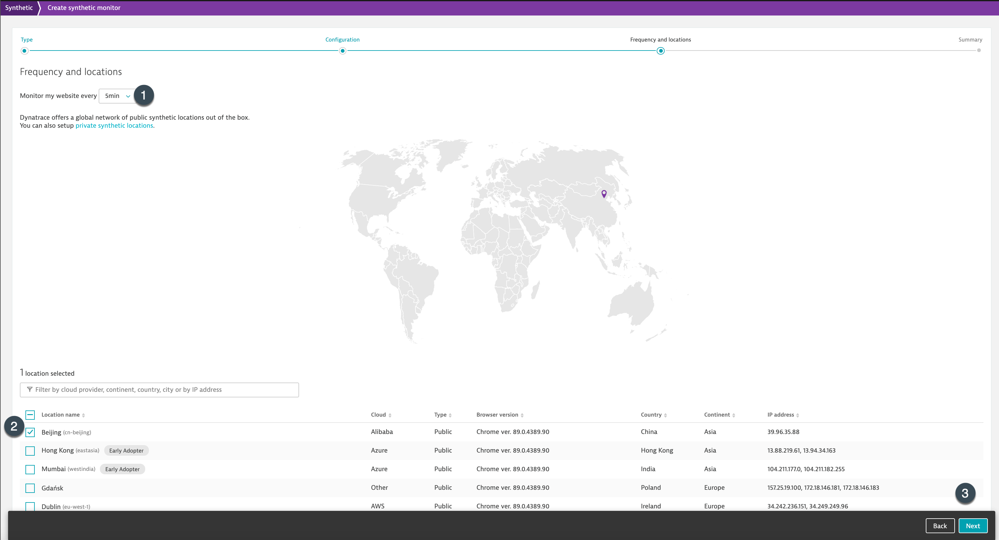
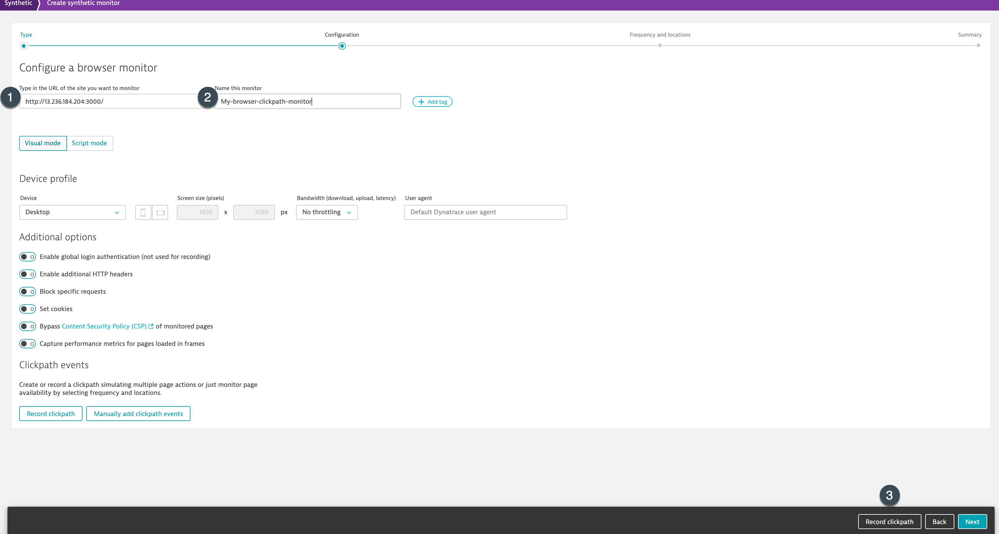
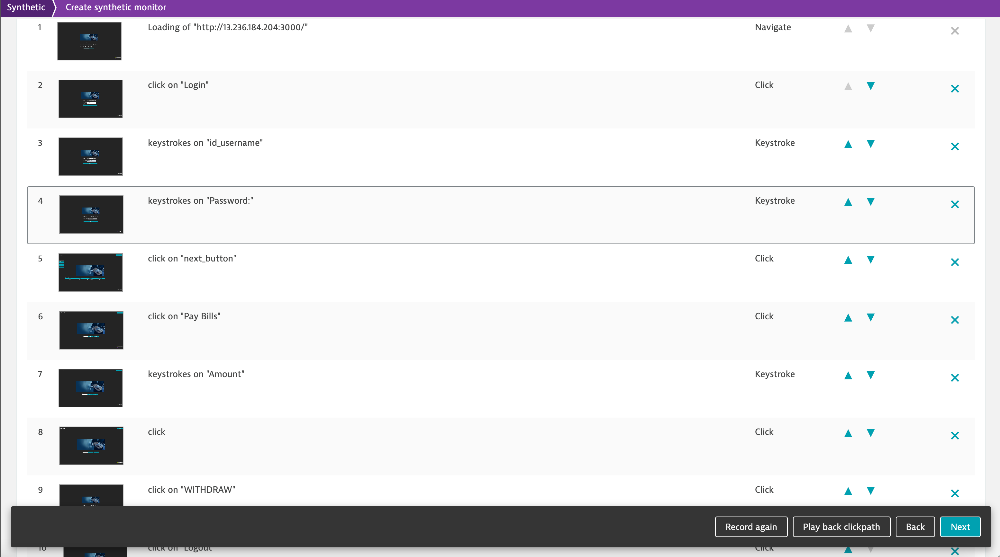

## Performance/Synthetic Testing

In this step, we will go through the different automated performance testing that Dynatrace provides.

Dynatrace provides multiple synthetic tests - Single URL tests, Clickpath, HTTP monitoring. These tests can be setup to run at different frequency and study the performance of your application in real-world.

### 1. Single URL browser monitor

Single URL browser monitor can be used to verify if a particular page is reachable on your application as well as provides an avenue to study the performance of the configured page. To setup a browser single URL monitor, follow the steps as below:
1. Within the tenant, select **Synthetic** from the navigation menu.
1. Now, select **Create a synthetic monitor** at top right > Create a browser monitor.
1. Further, on the Configure a browser monitor page, type in the URL `http://Instance-IP:{NodePort}/login` and provide a name say **My-app-single-URL-test** for your monitor.
Replace **AWS-IP** with the IP address.

1. Setup the frequency and the locations from where you would like to run the tests.

### 2. Browser Clickpath

Browser clickpath is useful for monitoring a series of actions and monitoring the performance of the user-actions. To start recording the clickpath, as a pre-requisite you would need to install the Dynatrace Synthetic Recorder extension. Make sure you give permissions to the extension in incognito window.
1. To install the extension and create your first browser monitor, navigate to **Synthetic** on the menu.
1. Further, select Create a synthetic monitor > Create a browser monitor.
1. Enter a valid URL for your application and name it `My-browser-clickpath-monitor`. Furhter click on **Create synthetic monitor page >> Record clickpath.**

1. 
Please note once you click on "Record clickpath", an icognito window would open. Use the window to record the actions that you would like to monitor using Synthetic Browser Clickpath.
Cancel and close the window to complete the recording.

1. Once completed, the recorded user-actions would appear on synthetic monitor page as seen in the screenshot.

1. Now, click on **Next** and select the frequency, locations from where you like to run the synthetic monitors.

<!-- ------------------------ -->
