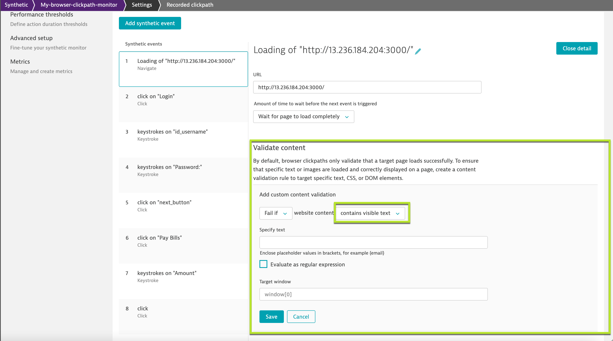
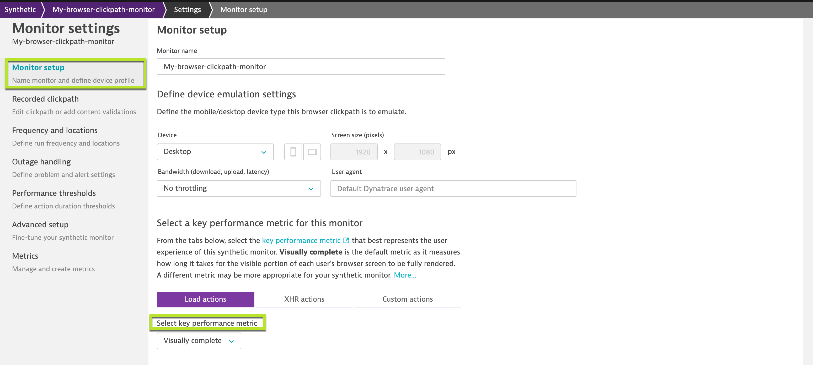
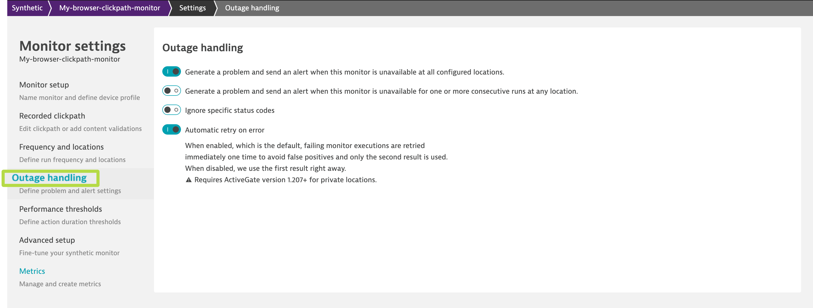

## ⚠️ Troubleshooting tips
These are locations where Dynatrace has AWS instances hosted and will trigger a chrome instance (using selenium) at the configured frequency. Hence, the locations can be selected for only publicly available endpoints or application. Make sure you whitelist the IP address of the selected locations - they are listed against the location-id.

### Additional configuration

### Validate content
You can configure to verify the recorded page/application has the elements loaded. In order to configure content validation, click on **Edit Clickpath** and  select the user-action for which you would like to verify contents.

### Performance thresholds
The synthetic monitors would collect all the metrics like visually complete, speed index, load event start, load event end, etc. You can set thresholds to generate a problem should the threshold be breached.
To do so, follow the steps as below:
1. Navigate to the synthetic monitor and click on (...) to edit the browser.
1. Now, under **Monitor setup** select the key performance metric from the dropdown:

1. Once the key performance parameter is configured, you can set thresholds/SLAs from **Performance thresholds** so that synthetic monitor triggers an alert once the thresholds are breached during a particular synthetic run.

### Outage handling
You can configure the synthetic monitors to alert for an outage from any configured location. To setup outage handling, follow the steps as below:
1.  Under Settings, select **Outage Handling**

Positive
: **NOTE** - You can choose to be alerted if the synthetic monitors are unreachable from either one or all the locations.

<!-- ------------------------ -->
