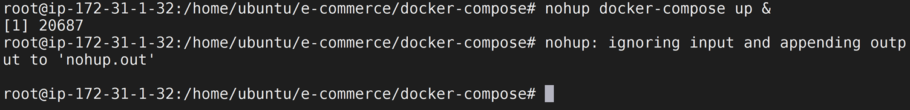

## Prerequisites

In this excerise, we will deploy the sample web application.

### Deploy the Application on your AWS Instance

* Navigate to the `docker-compose` folder using:
```
$ cd /home/ubuntu/e-commerce/docker-compose
```

* Run the following command to deploy your application:
```
$ nohup docker-compose up &
```


### Accessing the Application UI
Open up your **web browser** and access the sample application with `AWS IP ADDRESS`


<!-- ------------------------ -->
