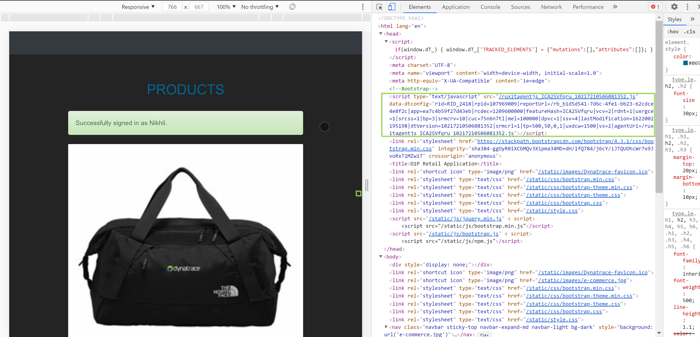
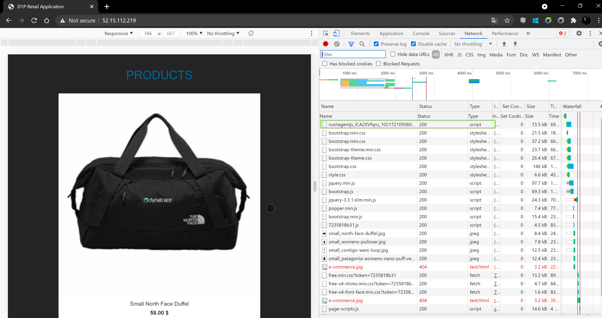
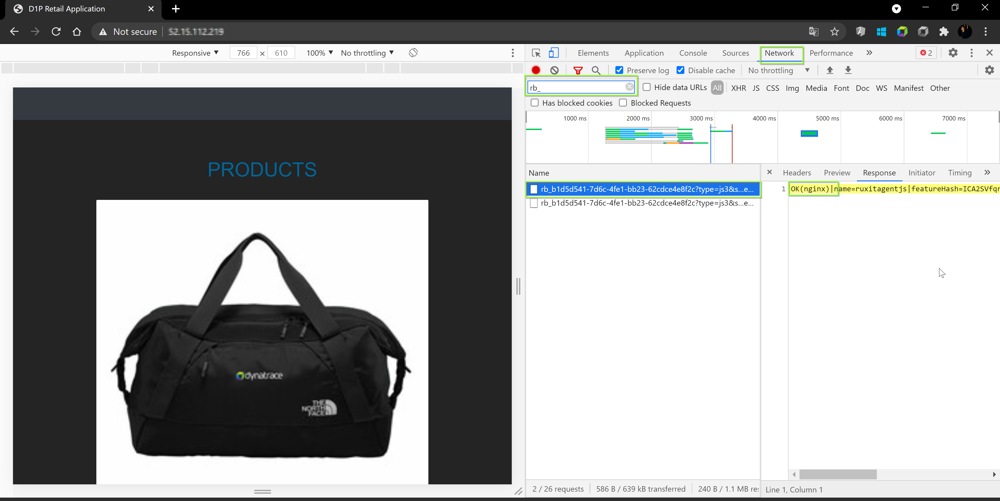
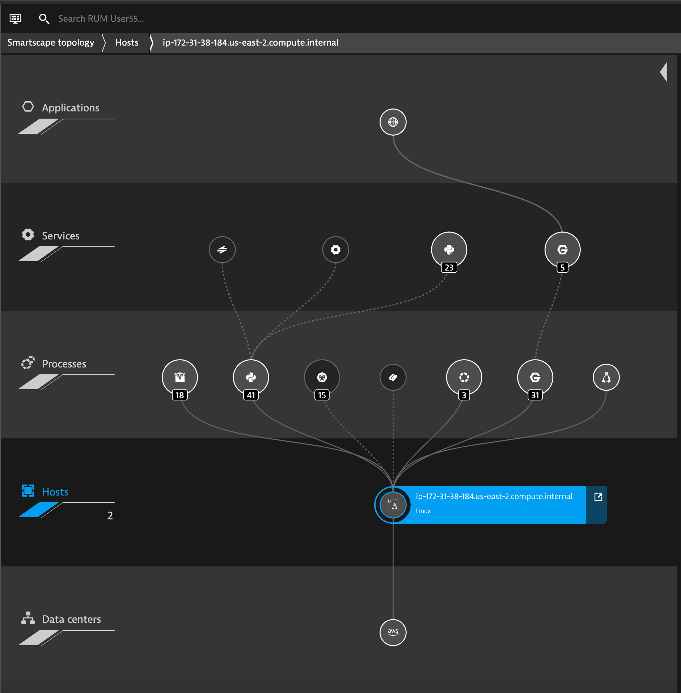

## Troubleshooting

In this excerise, we will verify if the OneAgent is monitoring the application.

### Confirming that the RUM JavaScript tag has been correctly injected into the application's HTML

Check for the Dynatrace JavaScript if the application contains the string `ruxitagentjs` in the **Source** files under the `HEAD` element.

```
<script> type="text/javascript" src="/ruxitagentjs_[...]_[...].js" data-dtconfig="[...]" </script>
```



### Confirming that the RUM JavaScript tag has downloaded correctly

With the help of browser DevTool, load the application's page and navigate to **Network** section. Confirm if the response of the JavaScript code exists with a response status `200 "OK"`.



### Confirming that RUM monitoring data is been sent to Dynatrace

The JavaScript Tag reports back data via XHR or CORS post requests. The requests can be viewed among the **Network** operations using the browser DevTools. The URL related to the request will begin with `rb_` and must have status `200 "OK"` response and must start with **`OK`**.



### Exploring Dynatrace

Login to the Dynatrace environment and explore around **Smartscape topology** and under **Host**, select the host. The Smartscape helps to identify the internal dependencies - both horizontal and vertical. It plays a pivotal role in identifying the root-cause and helps to identify how your entity/application placed in the environment.



<!-- ------------------------ -->
