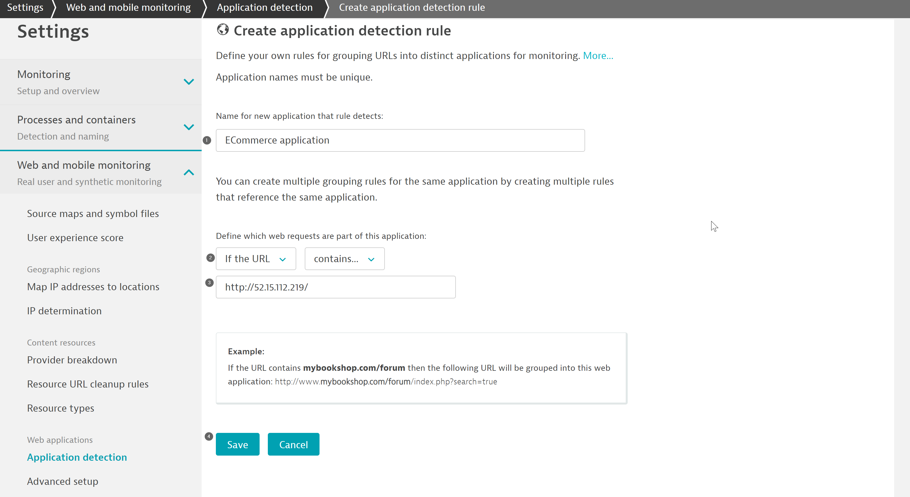
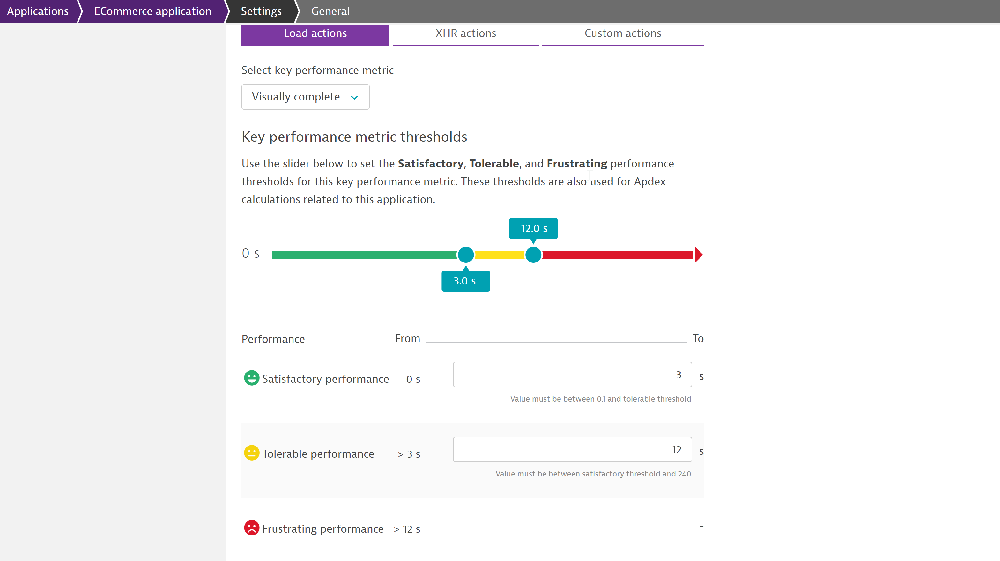

## Defining the Application

In this excerise, we will define an Application detection rule to route the traffic from the retail app into its own application.

As a starting point, all real-user monitoring data is encapsulated in a placeholder application called `My Web Application`. If no application detection rules are configured to split/uniquely identify the data for a specific application, all data would continue to be reported back in "My web application" in Dynatrace.

### Application detection rule

Application detection rules would facilitate to create more applications, change existing application mapping, or if needed define more complex rules when looking at URL's as well as domains.

From the navigation menu, select **Settings > Web and mobile monitoring > Applications detection**. Under the **Define application detection rule** section, the list of defined rules are available in the sequential order and the top of list takes the priority over the following rules.

Select **Add detection rule** and select the rule applies to `ECommerce application` and provide a custom name for the application under the name text field.

Define which web requests are part of this application by selecting the condition as `If the URL` and scope to be `contains` with the  `AWS IP ADDRESS`.

### Application Performance
Dynatrace uses **Apdex** which is an open standard rating for calculating the performance of software applications. Apdex helps to understand the user-experience and is dependent based on application-specific thresholds. These thresholds can be classified as "Satisfactory, Tolerable and Frustrating". These can be modified by navigating to **Applications > Application-name > Edit > General**.

