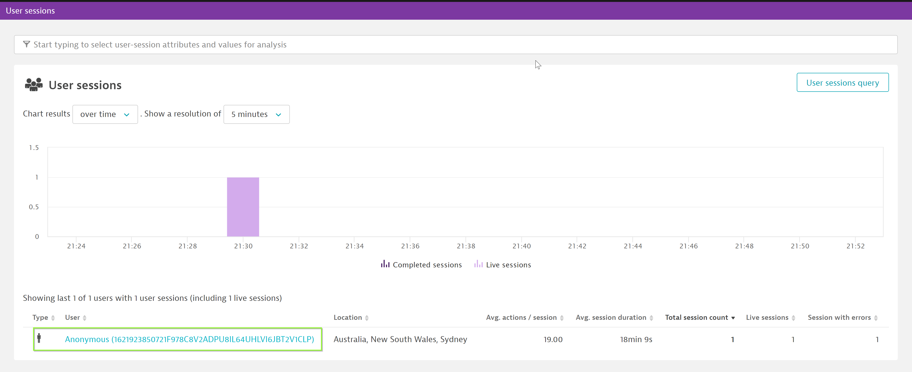
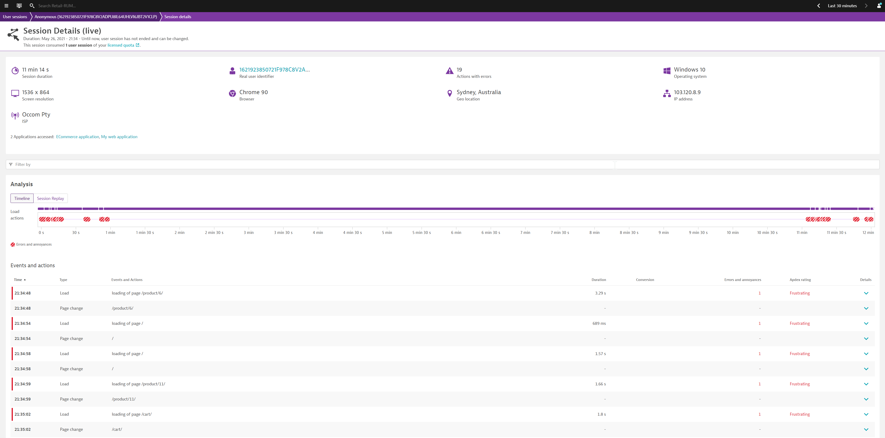
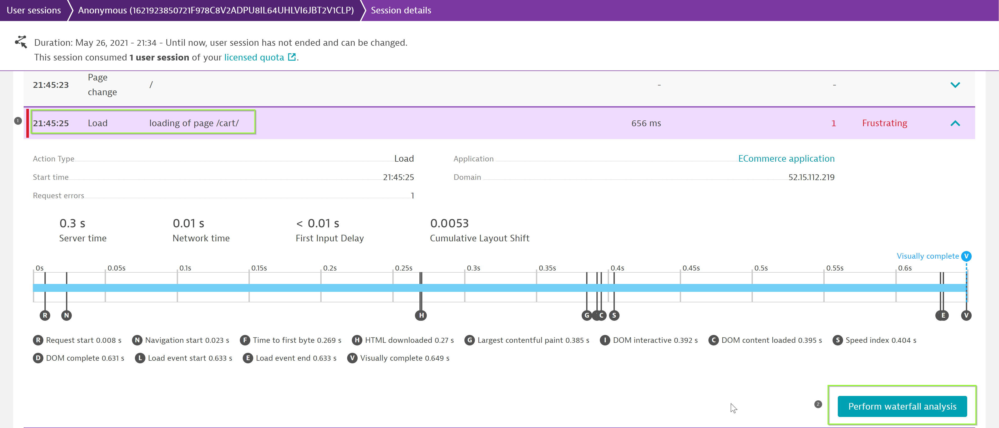
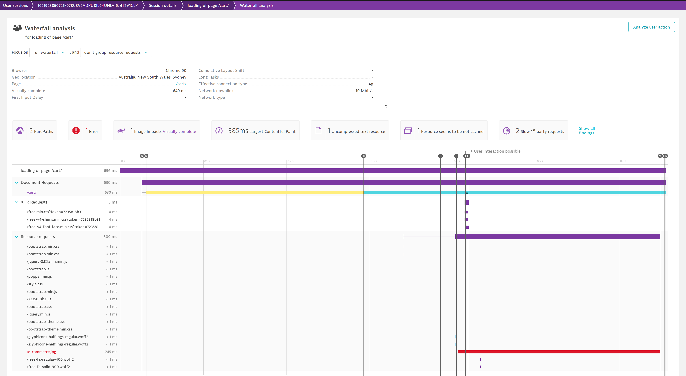
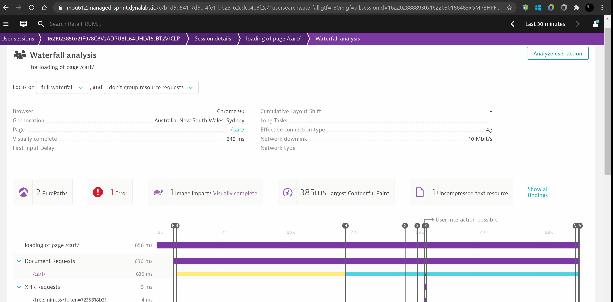
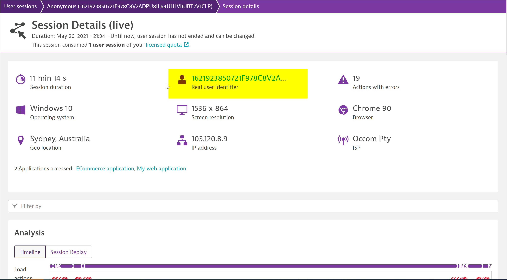
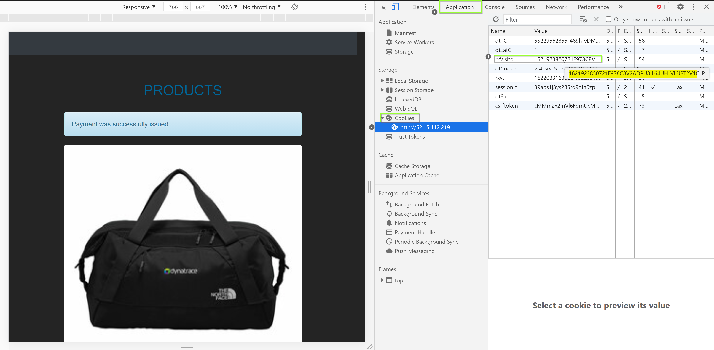

## RUM User Session Details
A **user action** is an interaction with the web browser on an application that involves one or multiple calls to the web server that may or may-not potentially have multiple nested calls. A **user session** covers those set of user-actions.

In this excerise, we will be highlighting "User Sessions" and different user actions captured in the user-session. We will also be looking into the waterfall model to view application load times.

1. Navigate to User sessions in the collapsable hamburger menu on the left. There should not be any user sessions currently.

1. Create a user session by browsing through the sample application in an incognito window and closing the window once you are finished.

1. Navigate back to the Dynatrace tenant and refresh the User session overview page, a user session should now appear.

1. Click into the user session in order to see the session details and a drill-down of the user actions which make up this user session.

For more details on how Dynatrace defines a user-session, please refer to the [documentation link.](https://www.dynatrace.com/support/help/shortlink/user-session#when-does-a-user-session-start)

### Waterfall Analysis
Dynatrace captures user experience and performance data by monitoring individual user actions. Typically a user action begins with a click on a HTML control (for example, a button or link). The browser then loads the requested data, either by navigating to a new page or via an XHR/fetch call. JavaScript callbacks are then executed, the DOM tree is built or changed, and the web application is then once again ready for a new user action.

Select a user action - for example, in this case we will select **Loading of page /cart/** and perform a waterfall analysis

Positive
: Waterfall model can be extremely useful to debug or analyse a specific request which may have occured as a result of the user-action and trace it back to the backend call.
In the example below, the waterfall analysis is used to analyse the error which occured during the downloading of a specific image in the application.

### Verify real user identifer is equal to cookie value
Dynatrace creates multiple cookies in order to uniquely identify a user-session. One of such cookie that Dynatrace creates on the end-user's system is **rxVisitor** and is pivotal in identifying the user uniquely.

In order to verify the cookie information, navigate to **User sessions** within your tenant and locate the user-session. Under the user-session screen, you will be able to identify the unique identifier as "Real User Identifier".

Navigate back to to the application within your browser and using Chrome dev tools (F12), find the cookie value and verify that it matches with the real user identifier.

Positive
