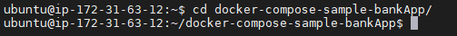
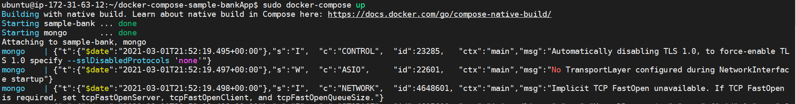
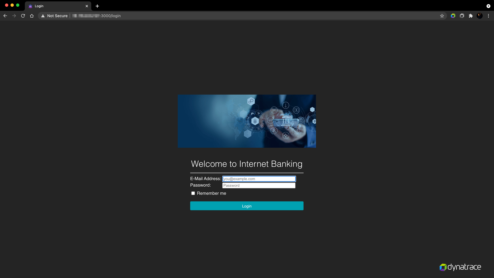

## Prerequisites
In this excerise, first we will start the sample web application.

### Start the Application on your AWS Instance

Use PuTTy (Windows), PowerShell (Windows) or Terminal (Mac), ssh into the instance using the following credentials:
**Username**: `d1prumworkshop`
**Password**:  `dynatrace`
Further execute `sudo su` to become the root user and execute the commands with root priviledge.

* Navigate to the docker-compose-bankApp folder using
```
$ cd /home/ubuntu/docker-compose-bankApp
```



* Run the following code to deploy your application:
```
$ sudo docker-compose up &
```


### Accessing the deployed application
Open up your **web browser** and access the sample application with `AWS IP ADDRESS:3000`


Positive
: If the IP address of your AWS instance has changed, modify the **Application Detection Rule** to accomodate the change in IP by navigating to **Settings > Web and mobile monitoring > Applications detection**

Once accessed, login into the application with the following credentials:
Username: guestuser@mybank.com
Password: GuestUser12@

Further, perform some actions on the application to generate an user-action and navigate to **User-sessions** within your tenant to find the user-session.

<!-- ------------------------ -->
