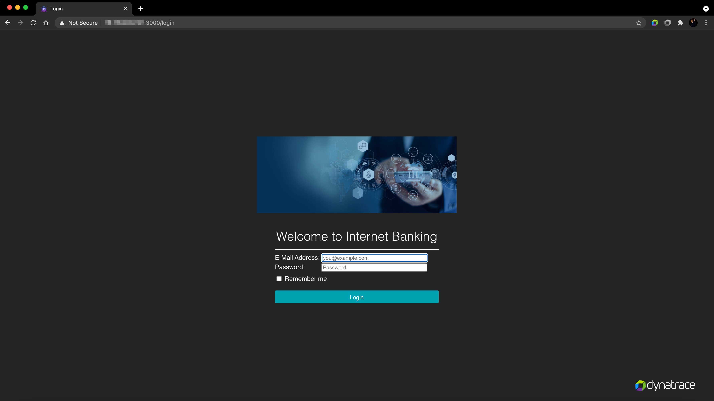

## Testing across releases
In this step, we will be setting up a session property to support canary releases.

Dynatrace provides multiple options to help identify the release information of a service/application. For more details, refer to our documentation [here](https://www.dynatrace.com/support/help/shortlink/version-detection).

In this exercise, we will explore the avenue to pull release information using the ENVIRONMENT VARIABLES.

Within EC2 instance, set the environment variable by running command: <br />
```
$ export DT_RELEASE_VERSION=3.0.0
```
This would set the environment variable and once the services/application is started, dynatrace would pick up the release information in sometime.


### Start the Application on your AWS Instance

* Within your Ec2 instance, navigate to the folder `/home/ubuntu/e-commerce/docker-compose/canary-release` the following command:

```
$ cd /home/ubuntu/e-commerce/docker-compose/canary-release
```

In the docker-compose file within the folder, we can see there are two services defined, which will spin up multiple docker images for both the backend and a nginx docker as frontend.


Run the following command to deploy the builds of the applications:
```
$ nohup docker-compose up &
```


Once executed, you will see multiple builds of your application running. Use the following command to check the different builds that are running:
```
$ docker-compose ps -a
```
These builds are bound to ports 3005 and 3006 on the host server and can be accessed through the loadbalancer.


### Accessing the Application UI
In this step, we will configure Dynatrace to help identify how the build version of the web pages from a particular user are being rendered. To do so, let us first understand the architecture of our deployment.


As we can see in the architecture diagram, there are multiple dockers running different builds of the application:
"ecommerce-backend" and "ecommerce-backend-latest".
These applications are listening on ports 3005 and 3006 respectively while there is a single service, "ecommerce-frontend" that is listening on port 80. The frontend service nginx is configured as a loadbalancer which renders traffic from different application services using an ip_hash algorithm. This can be validated by using a **web browser** and accessing the application at `AWS IP ADDRESS`.



If the application is different from multiple locations/different IPs, the browser is likely to render web-pages from different versions.
Hint: Look at the bottom of the page next to **D1P Step Program**, it will indicate build number as 1.0.0 if loadbalancer has rendered the request from 1.0.0 version.

Now, let us consider that you would like to identify the behavior of performance of your application in different versions before rolling it out on all the backend servers. In this case, it is nice to capture the version details from the user-sessions to distinguish the application performance between different releases. To achieve this, we will leverage our session properties feature.

To do so, within the Dynatrace tenant navigate to **Settings > Server-side service monitoring > Request Attributes** and click on "Define a request attribute"
1. Set the *Request attribute name* as "Release"
1. Select *Request attribute source* as "SDK custom attribute"
1. Set the *Attribute name* as "release-version"


1. Now, navigate to **Application > [...]Edit > Capturing > Session and action properties**. Under "Add property", copy the session property seen in the image below below:


This value was further retrieved using request-attribute and then attached to a specific session using a  session-property. Thereby, helping to identify the release number that
may be associated to a particular issue.


FYI: To retrieve a value using request-attribute in Dynatrace, you need to make sure the variable is available in the request header.


Positive
: If the application is being rendered from the same version, access the application from web-browser at `http://AWS IP Address:3005`. This is running version 1.0.0. Once accessed, perform some actions on the application to generate an user-action and navigate to **User-sessions** within your tenant to find the user-session. Repeat the same from web-browser at `http://AWS IP Address:3006` to access the application on version 3.0.0.

After a while, navigate to the menu option **Releases** within Dynatrace tenant to notice that release information has been auto-detected by Dynatrace.


After performing the above, we will be able to establish the build-version for each user-session and thereby, helping to identify the application performance across releases.
