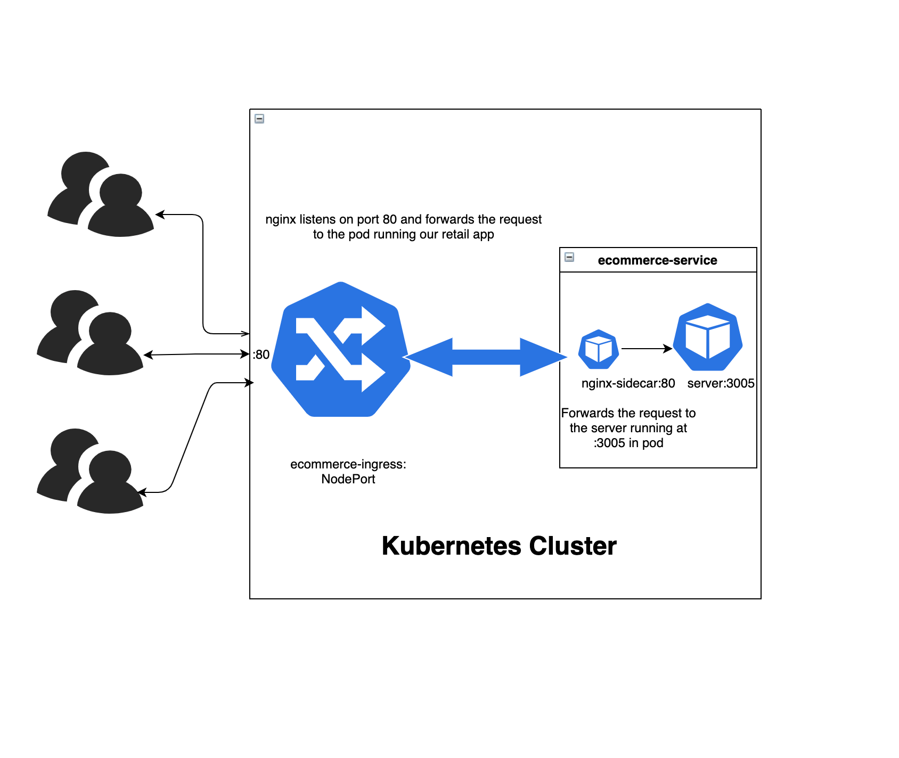
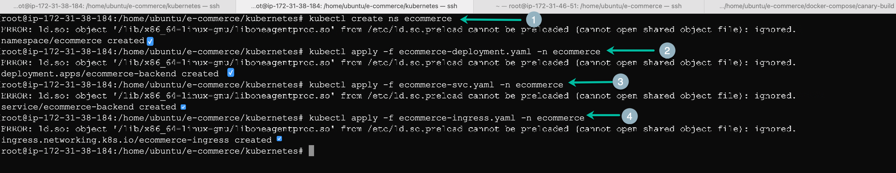
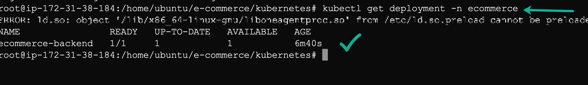
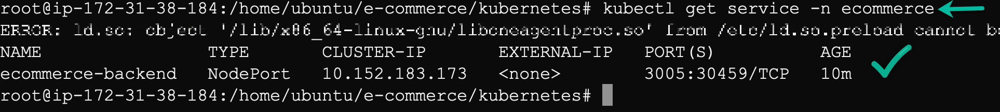
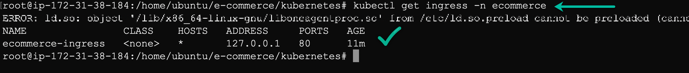
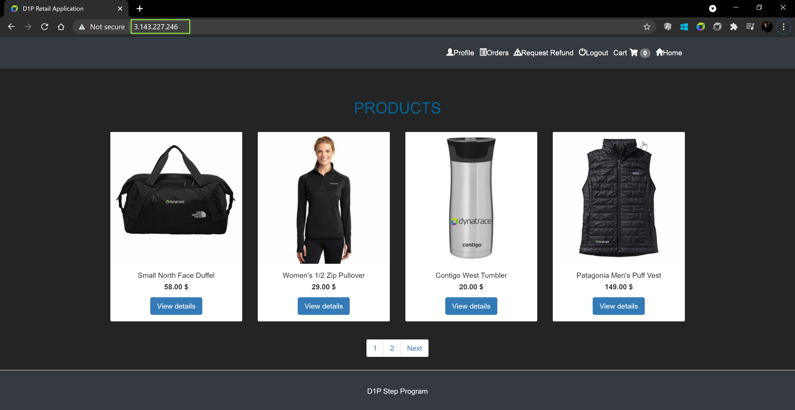

## Start the sample-application
To start the sample-application pods, navigate to `/home/ubuntu/e-commerce/kubernetes` folder using `cd /home/ubuntu/e-commerce/kubernetes/`.

Under that folder you would be able to view the manifest for deploying the application on the kubernetes cluster namely ecommerce-deployment, ecommerce-svc and ecommerce-ingress. Before starting the application, let us have a look at architecture of our application :


In order to deploy the application, run the following commands:
```
kubectl apply -f ecommerce-deployment.yaml -n ecommerce
kubectl apply -f ecommerce-svc.yaml -n ecommerce
kubectl apply -f ecommerce-ingress.yaml -n ecommerce
```


Once completed, you would be able to view the deployment pod, service and ingress (frontend) by executing commands as below.
```
kubectl get deployment -n ecommerce
kubectl get svc -n ecommerce
kubectl get ingress -n ecommerce
```




Now, confirm that you are able to access the application by navigating to http://AWS-IP


<!-- ------------------------ -->
