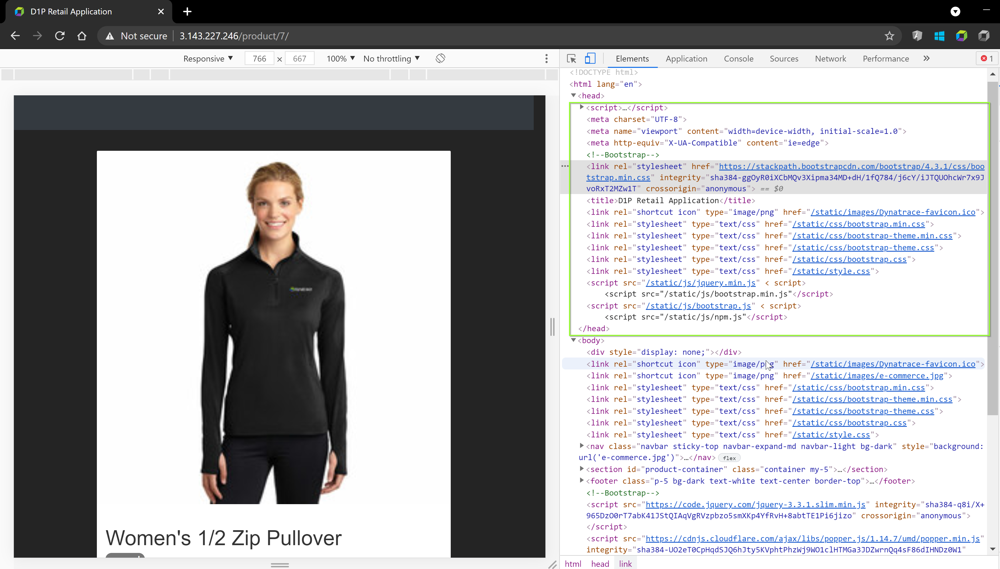
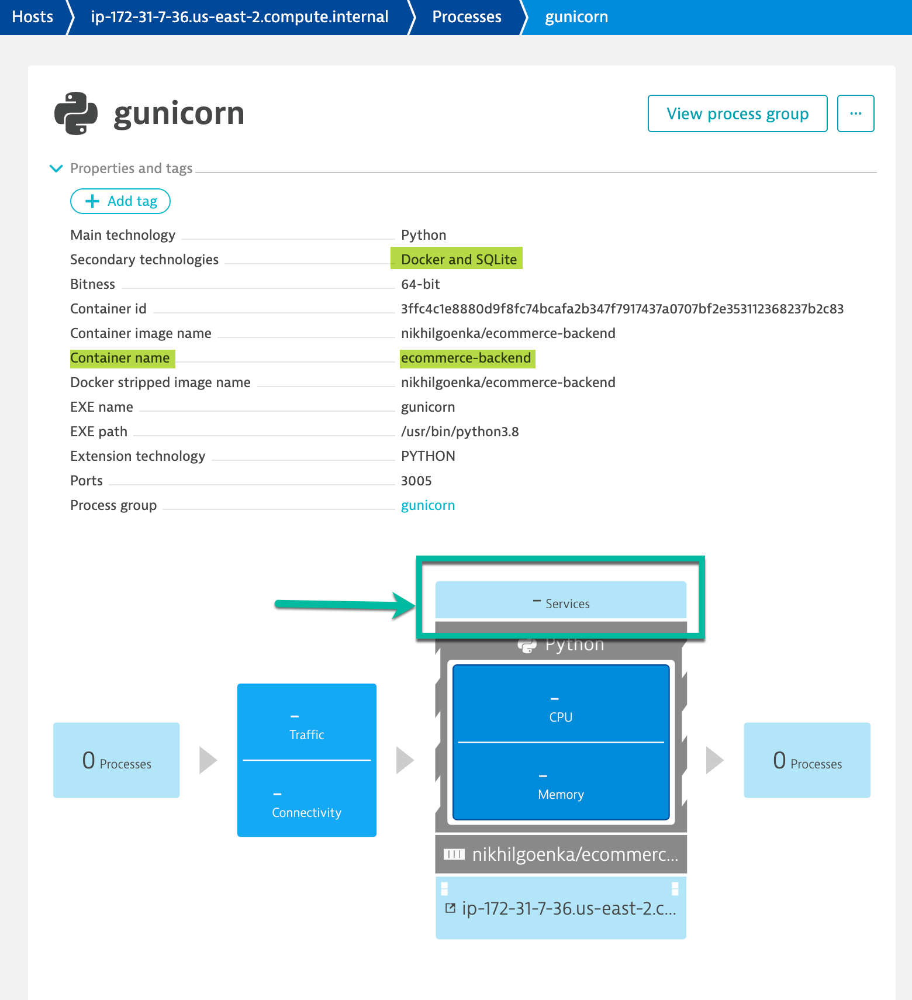
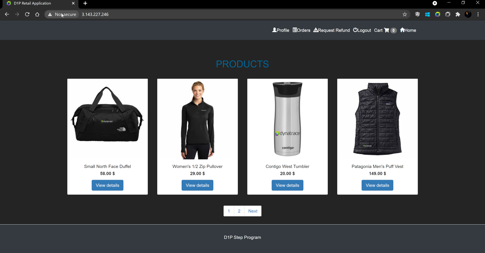
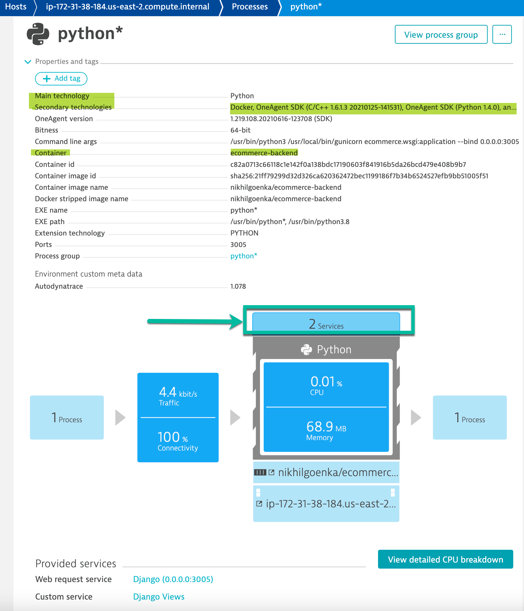
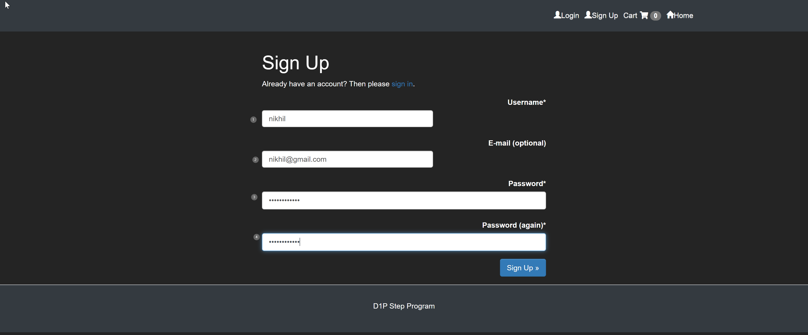

## OneAgent Application Injection
In this exercise, we will check the OneAgent injection into the application and verify the injection of the JavaScript in the application UI.

### How to check application is monitored by OneAgent?

Dynatrace injects a Javascript into the application to mointor it and report user activities.  This script is loaded under HEAD tag of the application. So, navigate to the application UI and open the browser's DevTools to check the **Elements** and check the `<HEAD>` element locating the JavaScript. Search the script that contains the string `ruxitagentjs` in its file name.



This can also be validated by Dynatrace. In order to do so, navigate to **Host > ec2-instance > gunicorn** which is the Application Process.

You will discover that Dynatrace automatically monitors the host metrics, containers and processes however, has not been able to pick the **services**



### Restarting E-Commerce Application

For Dynatrace to get Services (code-level visibility), the Application services needs to be restarted. To restart the application, follow the steps as below.

Within your EC2 instance, run the following command `/home/ubuntu/e-commerce/kubernetes` to restart the application:
```
kubectl rollout restart deployment ecommerce-backend -n ecommerce
microk8s disable ingress
microk8s enable ingress
```

Once restarted, verify if the application has been restarted succesfully by accessing `AWS-IP` in the browser


Post restart you will be able to verify that Dynatrace has identified additional information about the container, technologies on the container as well as the services. Navigate within your tenant to **Host > ec2-instance > python**


### Accessing the application
Within your browser, click **Sign-up** (available at the top right):
1. **Username**: Use your first name as the username
1. **E-Mail Address**: Provide any dummy email-id
1. **Password**: GuestUser12@
1. **Confirm Password**: GuestUser12@



Once you have completed signing up on the application, you will be logged in on the application at http://AWS-IP or login with the credentials as below:
**Username**: Your first name
**Password**: GuestUser12@

<!-- ------------------------ -->
