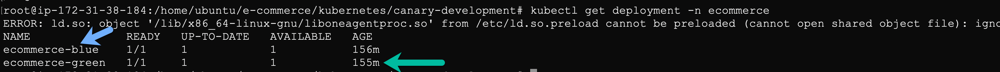

## Testing across releases
In this step, we will setup session property to help identify release version and monitor end-user's performance/business SLAs against each release, thereby, help to decide rollout.
Dynatrace provides multiple options to help identify the release information of a service/application. For more details, refer to our documentation [here|https://www.dynatrace.com/support/help/shortlink/version-detection]. For kubernetes, dynatrace identifies the version with the values of label **app.kubernetes.io/version**.


### Start the Application to simulate canary release on your AWS Instance with the following credetials:
**Username** : dynatrace
**Password** : dynatrace
Further, execute the following commands:
```
sudo su
kubectl delete ns ecommerce
```
These commands would ascertain that the existing setup is wiped clean.

Proceed to the `/home/ubuntu/e-commerce/kubernetes/canary-release` folder by using
```
cd /home/ubuntu/e-commerce/kubernetes/canary-release
```

You will find multiple deployment files present namely:
1. ecommerce-blue-deployment.yaml
1. ecommerce-green-deployment.yaml


These two files will help create deployments and services for green and blue releases. Further, another manifest file **ecommerce-ingress.yaml** would help configure the ingress service that will serve users from blue/green deployments.

Let us deploy the releases by running the commands :
```
$ kubectl create namespace ecommerce
$ kubectl apply -f ecommerce-blue-deployment.yaml -n ecommerce
$ kubectl apply -f ecommerce-green-deployment.yaml -n ecommerce
$ kubectl apply -f ecommerce-ingress.yaml -n ecommerce
```

Once executed, you will see multiple deployment pods and services of your application running. Use `kubectl get deployment -n ecommerce` to check the different deployments running.

Similarly, run `kubectl get service -n ecommerce`


The services are accesible on the ingress and will be routed through the loadbalancer and as the deployments had the labels set, Dynatrace would pick the release information automatically. To view the release information, navigate within Dyantrace tenant to **Releases** page:

The page gives a snapshot of all the releases running in your environment. Should you want to dig deeper into release manifest, click on a particular release to get a view as below:


Similarly, dynatrace would be able to identify the services on the green, blue deployments. To view the different services navigate to **Transaction & Services**:


### Accessing the Application UI
While the above is giving all the information w.r.t. backend, it is equally important to identify the release information for each user-session that can assist in identifying underlying issues in a release.
To capture the version details for each user-session, we will leverage session property feature.

To do so, within dynatrace tenant navigate to **Settings > Server-side service monitoring > Request Attributes** and click on "Define a request attribute"
1. Set the *Request attribute name* as "Release"
1. Select *Request attribute source* as "SDK custom attribute"
1. Set the *Attribute name* as "release-version"


1. Now, navigate to **Application > [...]Edit > Capturing > Session and action properties**. Under "Add property", add the session property as below:


Once configured, create an user session by performing the steps similar to below by accessing the application at `http://AWS-IP`:


FYI: To retrieve a value using request-attribute in Dynatrace, you need to make sure the variable is available in the request header.


Note:
In the e-commerce application, the function to push data to request-attribute is called when the user clicks on **Add to cart**, so make sure your user-session contains that user-action.

Once user-session is completed, the build-information value is retrieved from the pod-version label and further, using our configuration is attached to that specific session using session-property, thereby, helping to identify the release-number that the user was served from.


Performing the above we will be able to establish the build-version for each user-session and thereby, helping to identify the application performance across releases.

