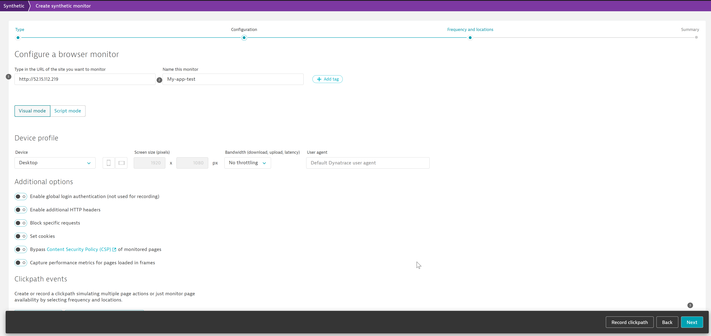
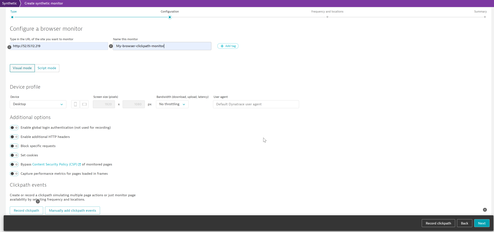
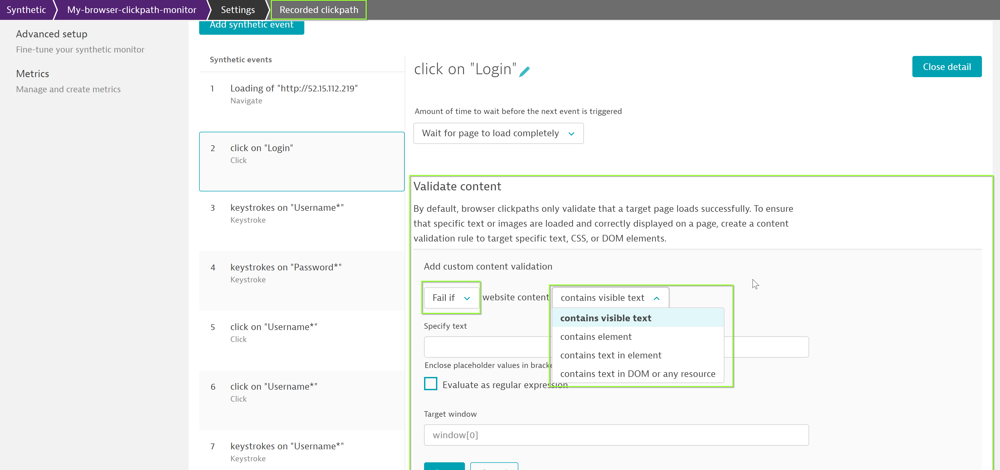
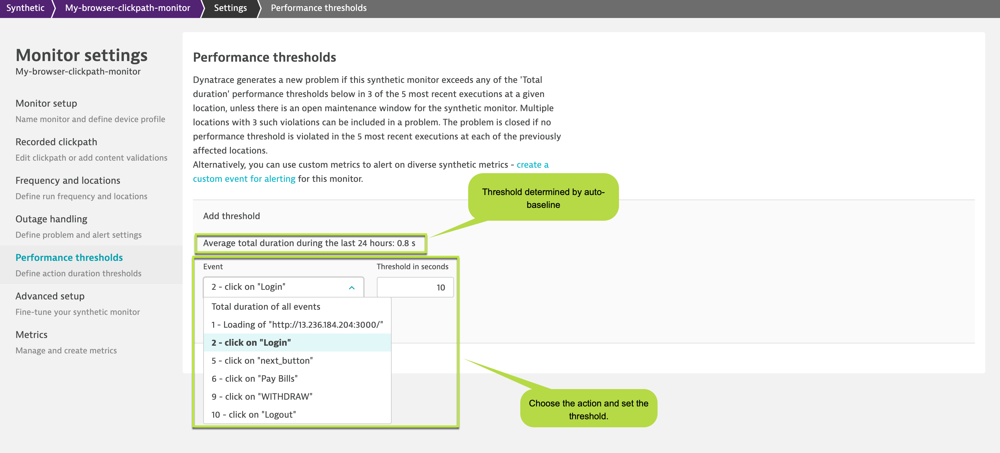

## Performance/Synthetic Testing
In this step, we will go through the different automated performance testing that Dynatrace provides.
Dynatrace provides multiple synthetic tests - Single URL tests, Clickpath, HTTP monitoring. These tests can be setup to run at different frequency and study the performance of your application in real-world.

### 1. Single URL browser monitor
Single URL browser monitor can be used to verify if a particular page is reachable on your application as well as provides an avenue to study the performance of the configured page. To setup a browser single URL monitor, follow the steps as below:
1. Within the tenant, select **Synthetic** from the navigation menu.
1. Now, select **Create a synthetic monitor** at top right > Create a browser monitor.
1. Further, on the Configure a browser monitor page, type in the URL `http://AWS-IP` and provide a name say **My-app-test** for your monitor.
Replace **AWS-IP** with the IP address that was shared with you earlier.

1. 

1. Setup the frequency and the locations from where you would like to run the tests.

1. 

  

### Browser Clickpath

Browser clickpath is useful for monitoring a series of actions and monitoring the performance of the user-actions. To start recording the clickpath, as a pre-requisite you would need to install the Dynatrace Synthetic Recorder extension. Make sure you give permissions to the extension in incognito window.
1. To install the extension and create your first browser monitor, navigate to **Synthetic** on the menu.
1. Further, select Create a synthetic monitor > Create a browser monitor.
1. Enter a valid URL for your application and name it `My-browser-clickpath-monitor`. Furhter click on **Create synthetic monitor page >> Record clickpath.**

1. 
Please note once you click on "Record clickpath", an icognito window would open. Use the window to record the actions that you would like to monitor using Synthetic Browser Clickpath.
Cancel and close the window to complete the recording.

1. Once completed, the recorded user-actions would appear on synthetic monitor page as seen in the screenshot.
1. 

1. Now, click on **Next** and select the frequency, locations from where you like to run the synthetic monitors.
1. 

  

### ⚠️ Troubleshooting tips
These are locations where Dynatrace has AWS instances hosted and will trigger a chrome instance (using selenium) at the configured frequency. Hence, the locations can be selected for only publicly available endpoints or application. Make sure you whitelist the IP address of the selected locations - they are listed against the location-id.

  

### Additional configuration
#### Validate content
You can configure to verify the recorded page/application has the elements loaded. In order to configure content validation, click on **Edit Clickpath** and  select the user-action for which you would like to verify contents.
1. 

#### Performance thresholds
The synthetic monitors would collect all the metrics like visually complete, speed index, load event start, load event end, etc. You can set thresholds to generate a problem should the threshold be breached.
To do so, follow the steps as below:
1. Navigate to the synthetic monitor and click on (...) to edit the browser.
1. Now, under **Monitor setup** select the key performance metric from the dropdown:
1. 
1. Once the key performance parameter is configured, you can set thresholds/SLAs from **Performance thresholds** so that synthetic monitor triggers an alert once the thresholds are breached during a particular synthetic run.
1. 

#### Outage handling
You can configure the synthetic monitors to alert for an outage from any configured location. To setup outage handling, follow the steps as below:
1.  Under Settings, select **Outage Handling**
1. 

NOTE: You can choose to be alerted if the synthetic monitors are unreachable from either one or all the locations.

