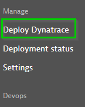
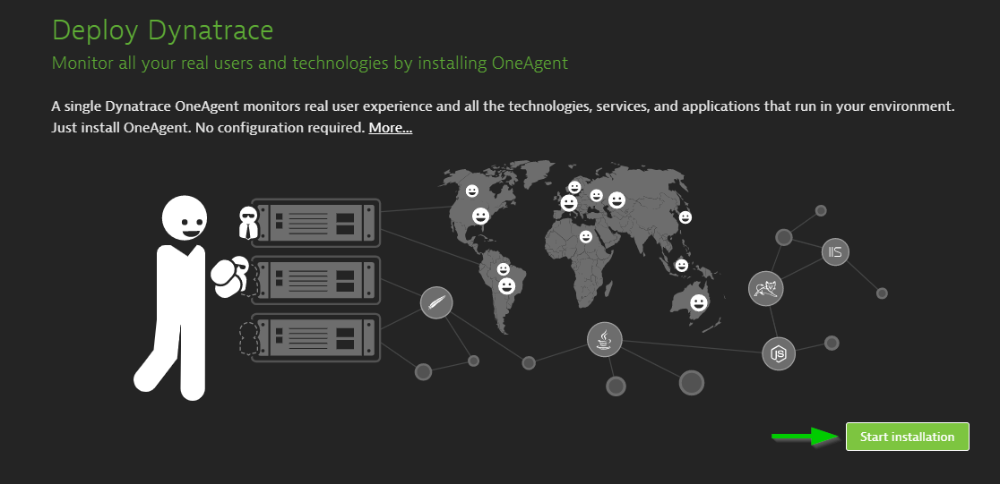
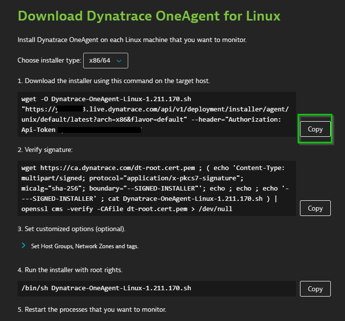
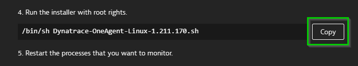
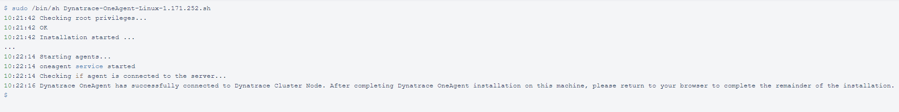

## OneAgent Installation

In this exercise, we will deploy the OneAgent to our Linux instance and let the OneAgent discover what is running in that instance.

### Download OneAgent

1. Open your browser and access the Dynatrace URL.

1. Select **Deploy Dynatrace** from the navigation menu.

1. Click the **Start installation** button and select **Linux**.

1. Choose the installer type from the drop-down list (we'll use the default x86/64). Use the Linux shell script installer on any Linux system that's supported by Dynatrace, regardless of the packaging system your distribution depends on.

1. Generate a Paas token by clicking on "Create token", or we can use our previously saved token if we have any.

1. **Copy** the command provided in the "Download the installer using this command on the target host" text field. **Paste** the command into your terminal window and execute it.

Positive
: Example:

### Execute the installation script

(Optional) Once the download is complete, you can verify the signature by copying the command from the *"Verify signature"* text field, then pasting the command into your terminal window and executing it. Make sure your system is up to date, especially SSL and related certificate libraries.

**Copy** the command from "Run the installer with root rights" text field.

Paste the command into your terminal window and execute it. You will need to make the script executable before you can run it.

Note that you will need root access. You can use sudo to run the installation script. To do this, type the following command into the directory where you downloaded the installation script.

Positive
: Example:

<!-- ------------------------ -->
