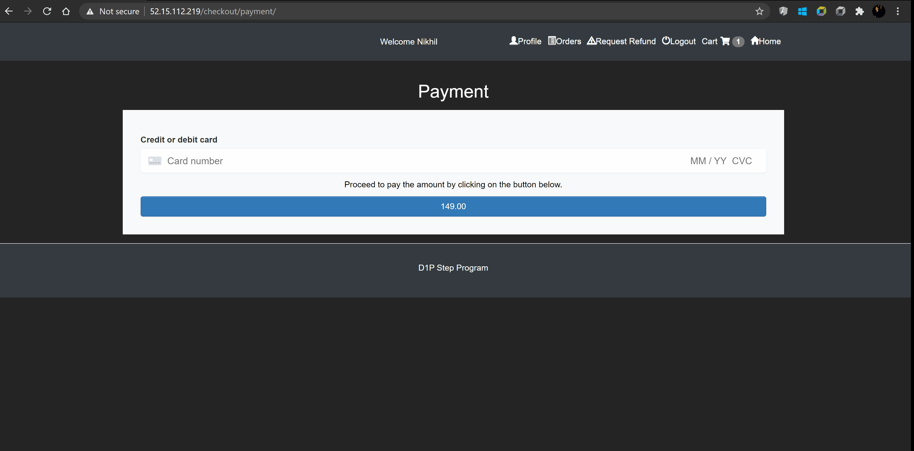
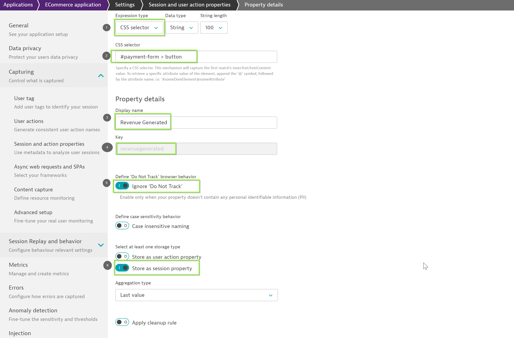
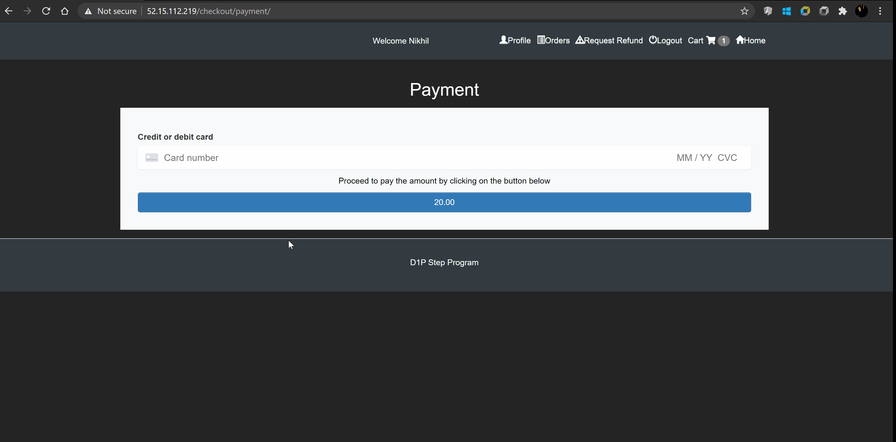
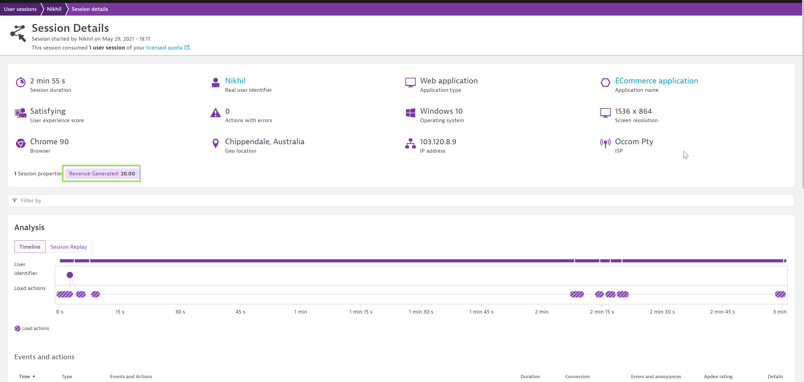

## User Session-Property

In this exercise, we will need to define session property to help highlight critical information for a session.

### Why session property
Session properties can be leveraged for deep visibility into all the details of your users’ interactions with your application and it can provide additional information to your end-users behaviour on the application.

### How to define a user-session property
Similar to user-tagging, dynatrace offers multiple avenues to define a session-property and can integrate with different property packs like Adobe, Google, etc. However, in this exercise we will limit ourselves to use *CSS selector* to define session property.

### Steps to define the user-session property
First, let us identify the CSS selector which we will configure as the session-property. Let us leverage session-property to identity the revenue generated during that session. In order to identify the CSS selector for payment, follow the steps as below:
1. Within your application, add some items to the cart.
1. Further, click on *Checkout* and fill the details of Shopping Address.
1. On clicking "Pay for the Order", it will render the payment page. Select the payment button and identify the CSS selector similar to the user-tag earlier.

Now with the CSS selector identified, proceed to Dynatrace tenant and follow the steps below
1. Select **Frontend** from the navigation menu and select "ECommerce application"
1. Click on "..." and select "Edit"
1. Click on "Capturing" and select "Session and action properties"
1. Select **Add property** and click on *Custom defined property*
1. Select **CSS selector** from *Expression type*, paste the CSS selector details copied earlier , provide *Display name* as "Revenue Generated", key as "revenuegenerated" and enable "Store as session property", "Ignore 'Do Not Track'" and click on *Save property*.

After setting it up, perform user actions to generate user session to reflect session property configuration. Session property is populated only for completed session, so terminate the session by performing the steps as below:

💡 We can use *incognito mode* to generate a completed session.

To review it, navigate to "User Sessions" and select the generated session. Under the session we can see our defined user session property as highlighted,

