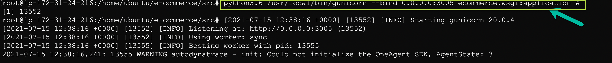

## Testing across releases
In this step, we will setup session property to support canary releases.

Dynatrace provides multiple options to help identify the release information of a service/application. For more details, refer to our documentation [here|https://www.dynatrace.com/support/help/shortlink/version-detection]
In this exercise, we will explore the avenue to pull release information using the ENVIRONMENT VARIABLES.

Within EC2 instance, set the environment variable by running command `export DT_RELEASE_VERSION=2.0.1`.
This would set the environment variable and once the services/application is started, dynatrace would pick up the release information in sometime.


### Start the Application on your AWS Instance

* Within your Ec2 instance, navigate to the `/home/ubuntu/e-commerce/src` folder,
```
$ cd /home/ubuntu/e-commerce/src
$ source myenv
```


* Run the following command to deploy your application:
```
$ python3.6 /usr/local/bin/gunicorn --bind 0.0.0.0:3005 ecommerce.wsgi:application &

$ service nginx start
```



### Accessing the Application UI
Open up your **web browser** and access the sample application with `AWS IP ADDRESS`


Once accessed, perform some actions on the application to generate a user-action.
After a while, navigate to any of your services under **Application & Microservices > Services** within Dynatrace tenant to notice that release information of the services has been auto-detected.

:bulb: If you want to review the user session, please navigate to **User-sessions** within your tenant.


Now, let us consider that you have restricted the new build only on some servers and want to monitor the behaviour of application before rolling out on other server.
In order to achieve it, we will leverage session property feature and identify if there are any issues with the newer build on end-user's experience on application.

To do so, within dynatrace tenant navigate to **Settings > Server-side service monitoring > Request Attributes**,
1. Click on "Define a request attribute"
1. Set the *Request attribute name* as "Release"
1. Click on "Add new data source"
1. Select *Request attribute source* as "SDK custom attribute"
1. Set the *Attribute name* as "release-version"
1. Click on "save" for data source and click "save" again for request attribute.


1. Now, navigate to **Frontend > Ecommerce Application  > [...]Edit > Capturing > Session and action properties**. Under "Add property", add the session property as below:


This value was further retrieved using request-attribute and then attached to a specific session using session-property, thereby, helping to identify the release-number that
may/is associated to a particular issue. Please generate a completed user session to view the changes.


FYI: To retrieve a value using request-attribute in Dynatrace, you need to make sure the variable is available in the request header.


