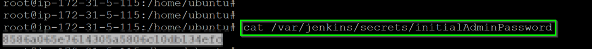

## Preconfiguration Setup

### Check if OneAgent is running
Log back into your Dynatrace environment and check if OneAgent is still running. On your left navigation, select **Hosts** and you should still see a monitored EC2 host.

### Retriving Jenkins Password
The initial password can be retrieved as `cat /var/jenkins/secrets/initialAdminPassword`

With the retrieved password, access the Jenkins URL via your web browser.

Within your Host View, dropdown the **Properties and Tags** and you will get a list of various metadata associated with the host created. Locate the **Public IP Address** and copy its value.

Open up your **web browser** and access the Jenkins URL via `http://AWS-PUBLIC-IP:8020`

<!-- ------------------------ -->
