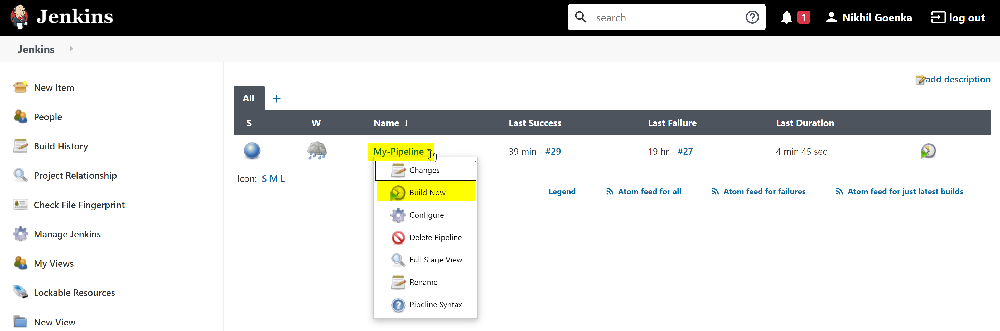

## Creating Jenkins Build
During the build, we will create a synthethic monitor, so make sure the token that has been imported in Jenkins has appropriate permissions as below. To verify token permission, follow the steps below:

* Go to **Settings > Integration > Dynatrace API > Generate Token**
* Select the token that was imported into Jenkins.
* Make sure it has the permission to **Create and read synthetic monitors**
* If not, toggle **Create and read synthetic monitors, locations, and nodes**.
* Click on **Save**

### Simulate SLA/SLO
* To simulate SLA/SLO, select one of the requests from the sample-bank-app by navigating to **Transaction & Services > node-bank > View dynamic requests** and select timeframe as **Last 7 days**.

* **Mark the request as key-request** as shown below.

Negative
:After marking the key-request, access the request within browser at ***http://{IP-address}:3000/api/users*** so that new requests appear under anomaly detections.

Now, let us configure the request to have a hypothetical threshold (which will be your SLA/SLO). To do so;
* Navigate to **Transaction & Services > node-bank > Edit > Anomaly detection**.

* Set the **threshold** to a ***low value*** say (eg. 2ms) so that a problem will be generated.

### Trigger a new Jenkins-build
Within Jenkins, navigate to **Homepage** and click on **Build Now** as seen below

### Build failure
The build is likely to fail with a problem highlighting the **key-requests has exceeded configured threshold**. A sample problem looks like below:

On the right-hand side of the problem generated, Dynatrace would highlight the ***probable root-cause*** and the **associated tools** that can be used to analyse the issue.

Positive
:Using these tools would help the developer to get to a quicker resolution.

As one problem would be open, our pipeline would be stalled with Staging not proceeding to Production. So in order to proceed, ***manually close the problem*** within dynatrace.

From Jenkins, **trigger the build** again.

<!-- ----------------------- -->
