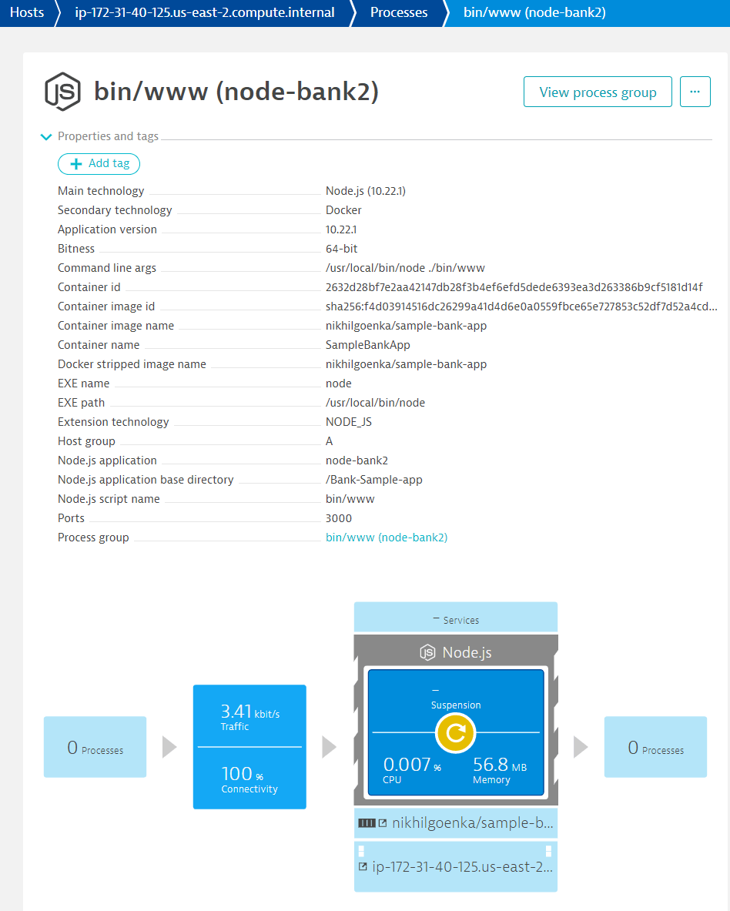
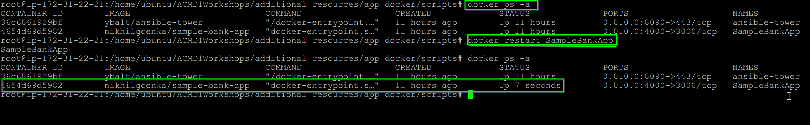

## Restart Docker
Duration: 10

### Exploring Dynatrace

Login to your Dynatrace environment and explore around **Smartscape**, **Host View**.

Go to **Host > ec2-instance > SampleOnlineBankProduction (Process)**

You will discover that Dynatrace automatically monitors your host metrics, processes but **services** are missing.

### Restarting SampleBankApp

For Dynatrace to get Services (code level visibility), you will need to restart the Application services. Since the application is containerized, the easiest way to do that is to restart the docker containers.

To **list all the docker containers**, run `# docker ps -a`

Run the following command to restart `# docker restart SampleBankApp` to **restart the Sample Banking App**

To check and **verify that SampleBankApp container has restarted**, run `# docker ps -a` again
To **list all the docker containers**, run `$ docker ps -a`

Run the following command to restart `$ docker restart SampleBankApp` to **restart the Sample Banking App**

To check and **verify that SampleBankApp container has restarted**, run `$ docker ps -a` again

<!-- ------------------------ -->
## Restart Docker
Duration: 10

### Exploring Dynatrace

Login to your Dynatrace environment and explore around **Smartscape**, **Host View**.

Go to **Host > ec2-instance > SampleOnlineBankProduction (Process)**

You will discover that Dynatrace automatically monitors your host metrics, processes but **services** are missing.

### Restarting SampleBankApp

For Dynatrace to get Services (code level visibility), you will need to restart the Application services. Since the application is containerized, the easiest way to do that is to restart the docker containers.

To **list all the docker containers**, run `# docker ps -a`

Run the following command to restart `# docker restart SampleBankApp` to **restart the Sample Banking App**

To check and **verify that SampleBankApp container has restarted**, run `# docker ps -a` again
To **list all the docker containers**, run `$ docker ps -a`

Run the following command to restart `$ docker restart SampleBankApp` to **restart the Sample Banking App**

To check and **verify that SampleBankApp container has restarted**, run `$ docker ps -a` again

<!-- ------------------------ -->
## Restart Docker
Duration: 10

### Exploring Dynatrace

Login to your Dynatrace environment and explore around **Smartscape**, **Host View**.

Go to **Host > ec2-instance > SampleOnlineBankProduction (Process)**

You will discover that Dynatrace automatically monitors your host metrics, processes but **services** are missing.

### Restarting SampleBankApp

For Dynatrace to get Services (code level visibility), you will need to restart the Application services. Since the application is containerized, the easiest way to do that is to restart the docker containers.

To **list all the docker containers**, run `# docker ps -a`

Run the following command to restart `# docker restart SampleBankApp` to **restart the Sample Banking App**

To check and **verify that SampleBankApp container has restarted**, run `# docker ps -a` again
To **list all the docker containers**, run `$ docker ps -a`

Run the following command to restart `$ docker restart SampleBankApp` to **restart the Sample Banking App**

To check and **verify that SampleBankApp container has restarted**, run `$ docker ps -a` again

<!-- ------------------------ -->
