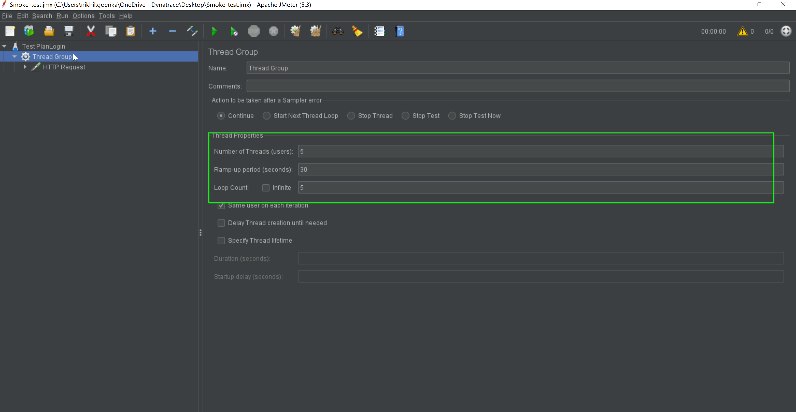
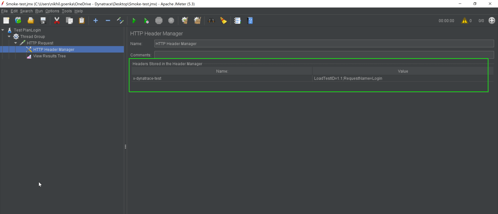
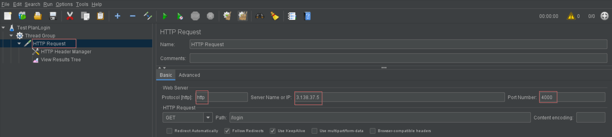

## JMeter Performance Testing

For the purposes of the lab, we will demo with the **Jmeter thick client**. The same capabilites will be triggered and used within the labs using CLI via SSH.

<!-- ------------------------ -->
## JMeter Performance Testing

For the purposes of the lab, we will demo with the **Jmeter thick client**. The same capabilites will be triggered and used within the labs using CLI via SSH.

<!-- ------------------------ -->
## JMeter Performance Testing

For the purposes of the lab, we will demo with the **Jmeter thick client**. The same capabilites will be triggered and used within the labs using CLI via SSH.

<!-- ------------------------ -->
