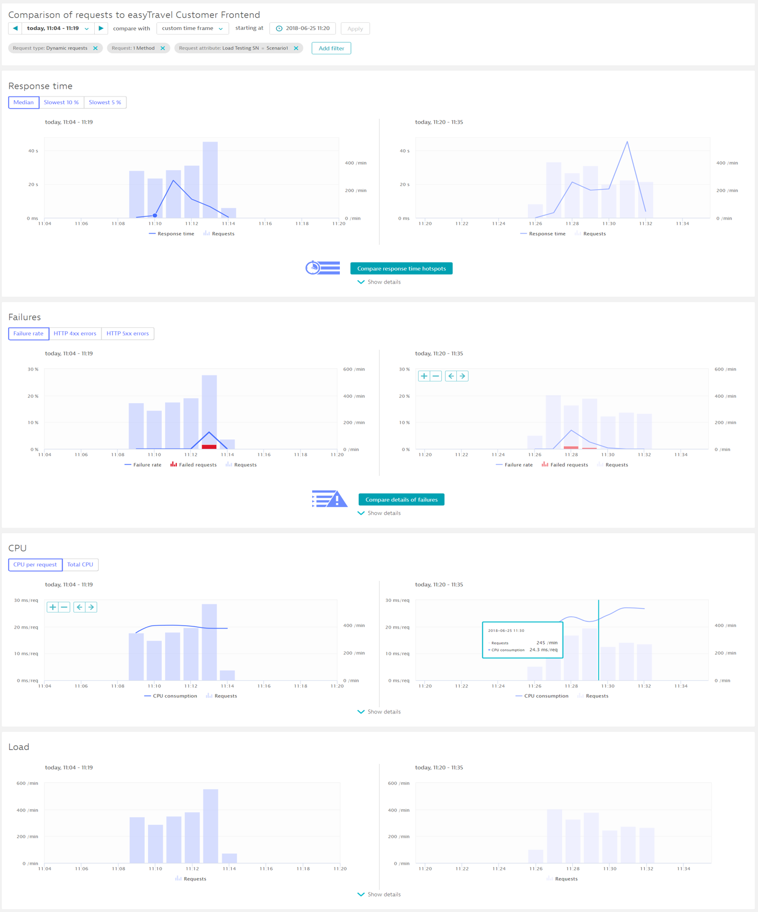

## Compare and Analyze events
Duration: 15

There are many different ways to analyze the data. Your approach should be based on the type of performance analysis you want to do (for example, crashes, resource and performance hotspots, or scalability issues).

Official Dynatrace Documentation [here] (https://www.dynatrace.com/support/help/shortlink/load-testing-process#compare--analyze)

<!-- ------------------------ -->
## Compare and Analyze events
Duration: 15

There are many different ways to analyze the data. Your approach should be based on the type of performance analysis you want to do (for example, crashes, resource and performance hotspots, or scalability issues).

Official Dynatrace Documentation [here] (https://www.dynatrace.com/support/help/shortlink/load-testing-process#compare--analyze)

<!-- ------------------------ -->
