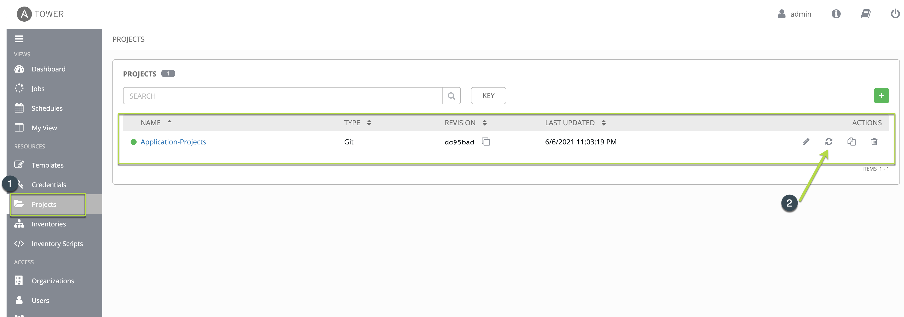
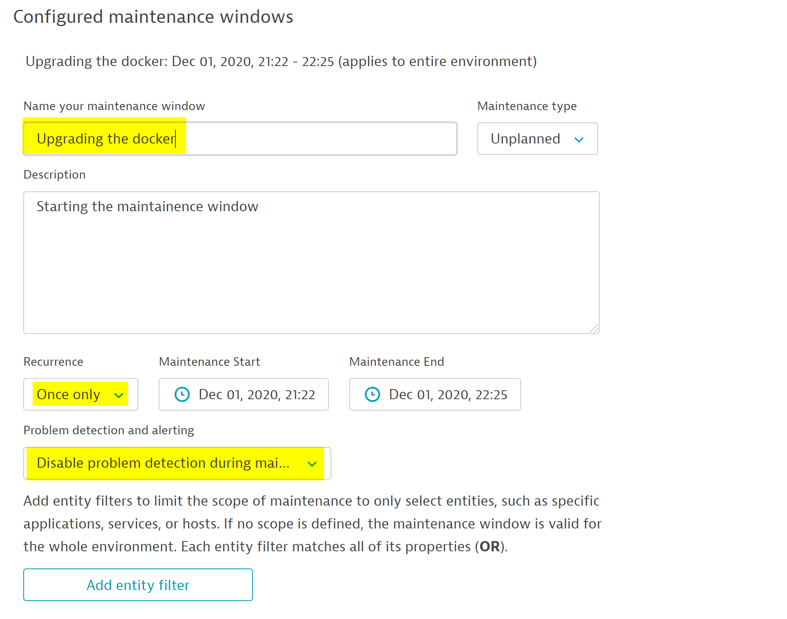

## Update Ansible playbooks:
Within ansible-tower, navigate to **Projects** and click on the symbol as seen below to *Update the SCM* and get the latest playbooks.

This would help download the latest playbooks.

### Maintainence Window
Now, let us setup a maintainence window so that Dynatrace does not trigger an alert when we deploy the new version of the docker/model-app.

To do so, within your dynatrace tenant, navigate to **Settings > Maintainence > Maintainence Windows > Create Maintainence Window"** and add the maintainence window to supress alerts for the next 5 mins as seen below.

